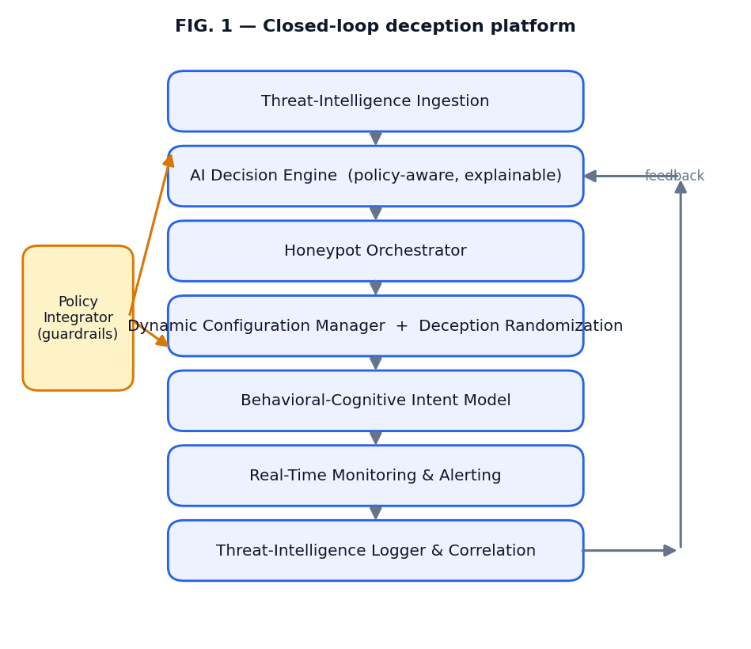
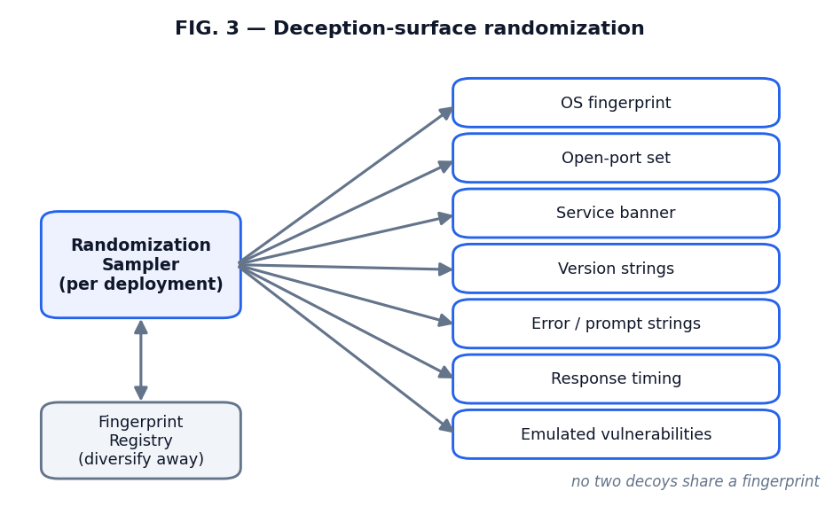
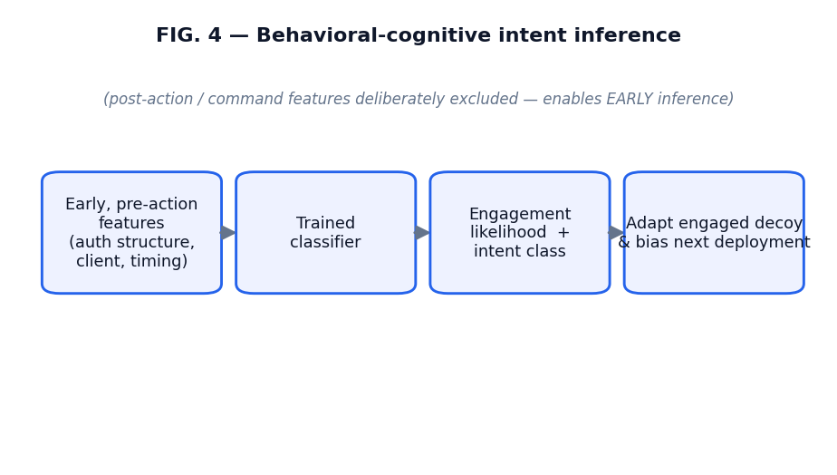
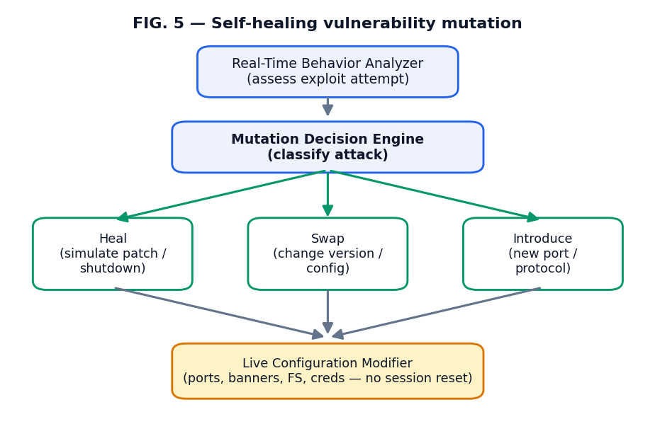
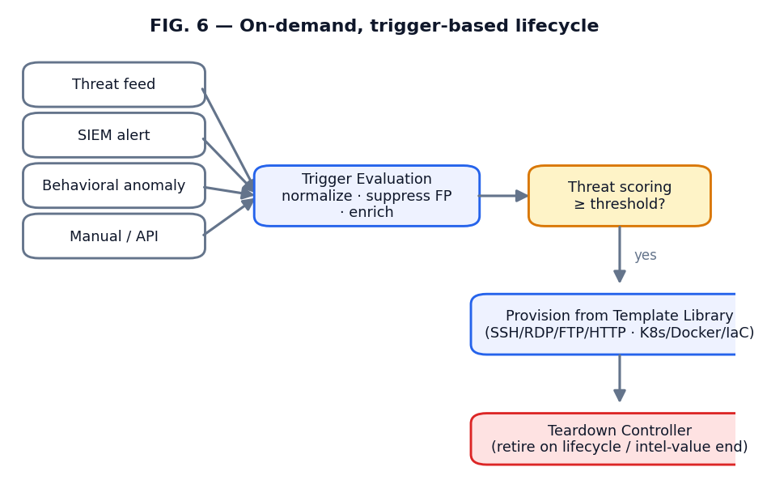
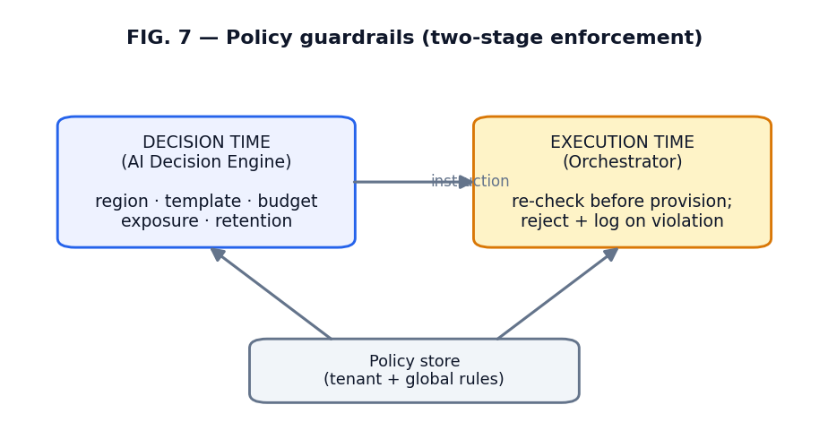
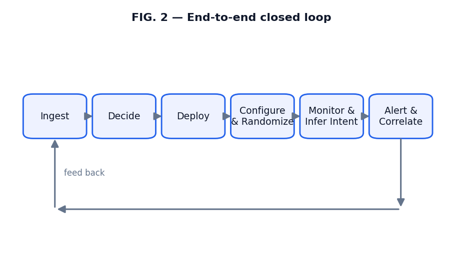

# Systems and Methods for Autonomous, Threat-Intelligence-Driven Deployment and Behaviorally-Adaptive Configuration of Deception Assets

**Application type:** Provisional patent application (draft for filing)
**Inventors:** Onyekachi Agudosi; Harshavardhan Malla; Sasi Preetham Rangudu
**Applicant / Assignee:** NovusAI
**Priority date:** to be assigned at filing

---

## Cross-Reference to Related Applications

This application is associated with the Novus Aegis AI ("Aegis") dynamic-honeypot
program documentation (v1.0, 11 February 2026) and with the inventors' research on
behavioral-cognitive attacker-intent modeling from honeypot interaction telemetry.
It consolidates four related deception inventions — (i) language-model-driven
interactive honeypot response, (ii) threat-intelligence-driven dynamic deployment,
(iii) self-healing vulnerability mutation, and (iv) on-demand trigger-based
deployment and teardown — which may be claimed together or divided. No related
applications are presently on file.

## Technical Field

The present invention relates to network security, cyber-deception, and autonomic
computing. More particularly, it relates to a system and method for autonomously
deploying, configuring, randomizing, and continuously adapting a population of
deception assets (honeypots and related decoys) across one or more computing
environments, wherein deployment and configuration decisions are driven by live
threat intelligence and by inferred attacker intent derived from observed
interaction behavior, and wherein all autonomous actions are bounded by
machine-enforceable cost, exposure, and compliance policies.

## Background

### Deception and its operational value

A honeypot is a decoy computing resource instrumented to attract and observe
unauthorized interaction. Because legitimate users have no reason to touch a decoy,
interaction with a honeypot is inherently high-signal: it yields low-false-positive
detections and rich forensic evidence of adversary tactics, techniques, and
procedures (TTPs). Deception is therefore attractive for security operations
centers (SOCs), threat hunting, and incident response.

### Limitations of the prior art

Despite this value, conventional deception suffers from systemic limitations that
the present invention addresses.

1. **Static configuration and fingerprintability.** Conventional honeypots are
   configured once and remain fixed. Their service banners, open-port sets,
   operating-system fingerprints, response timing, and emulated vulnerabilities do
   not change. Sophisticated adversaries and automated reconnaissance frameworks
   maintain signatures of common decoy software and known-default deployments, and
   can therefore fingerprint and avoid static honeypots. Once a decoy is
   recognized, its intelligence value collapses.

2. **Slow adaptation to a shifting threat environment.** Adversary campaigns shift
   rapidly across targeted services, vulnerabilities, and regions. A statically
   placed decoy does not track current threat intelligence and consequently
   provides poor coverage of emerging campaigns and presents a low-value target at
   the wrong place and time.

3. **Manual operational overhead that does not scale.** Selecting where, when, and
   how to deploy decoys, and re-tuning them over time, requires scarce expert labor.
   This does not scale across multi-cloud, hybrid, and multi-tenant estates.

4. **Low-fidelity, low-context output.** Static honeypots emit large volumes of raw
   logs rather than prioritized, enriched, attributable intelligence. Analysts must
   manually correlate sessions into actors and campaigns.

5. **Absence of intent modeling.** Prior deception treats all interaction
   uniformly and reacts only after an attacker has acted (for example, after a
   payload is delivered). It does not infer, from early pre-action behavior, *what
   the attacker is trying to do*, and therefore cannot adapt the decoy in time to
   maximize engagement and intelligence yield.

6. **Unbounded or unsafe autonomy.** Approaches that introduce automation rarely
   bound it: there is no principled, machine-enforceable control of cost, public
   exposure, region, data handling, and compliance, nor an auditable record of why
   each autonomous action was taken.

There is accordingly a need for a deception system that (a) closes the loop between
live threat intelligence, autonomous deployment, observation, and learning; (b)
continuously randomizes the deception surface to resist fingerprinting; (c) infers
attacker intent from early behavior and adapts accordingly; and (d) constrains all
autonomy with explainable, machine-enforceable policy.

## Summary of the Invention

The invention provides a closed-loop, policy-bounded, AI-driven deception system. In
various aspects:

- An **artificial-intelligence decision engine** ingests normalized threat
  intelligence and internal telemetry and, subject to machine-enforceable policy,
  emits an **explainable deployment instruction** specifying a honeypot type,
  location, interaction level, emulated vulnerability profile, and time-to-live,
  together with a rationale identifying the contributing signals.

- An **orchestrator** provisions the specified deception assets across one or more
  computing environments using infrastructure-as-code, and a **dynamic
  configuration manager** configures them and **randomizes their deception surface**
  so that no two deployments present an identical fingerprint, thereby resisting
  adversarial reconnaissance.

- A **behavioral-cognitive intent model** infers, from early pre-action interaction
  features, the probable intent or archetype of an interacting adversary, and the
  decision engine uses the inferred intent to adapt the configuration of the
  engaged decoy and the placement of subsequent decoys.

- A **monitoring and correlation subsystem** converts observed interaction into
  enriched, technique-mapped alerts and into longitudinal attacker profiles, and
  returns observed behavior to the decision engine, **closing a feedback loop** that
  continuously optimizes the deception population.

- A **policy integrator** enforces cost, exposure, region, retention, and compliance
  constraints at both decision time and execution time, so that autonomy is bounded
  and auditable.

- A **self-healing vulnerability-mutation** subsystem modifies the exposed
  vulnerabilities and interaction surface of a decoy *during a live session* —
  healing, swapping, or introducing attack surface — without terminating the
  session, so that a decoy is not exhausted once a known flaw is exploited.

- An **on-demand, trigger-based** subsystem provisions decoys in response to
  discrete threat, alert, anomaly, or manual triggers gated by a threat score, and
  decommissions them when their lifecycle or intelligence value is complete.

These aspects may be practiced separately or in combination; the deception-surface
randomization, the intent-driven adaptation, the self-healing mutation, and the
on-demand triggering each constitute independent inventive concepts.

## Brief Description of the Drawings

- **FIG. 1** — System block diagram of the closed-loop deception platform.
- **FIG. 2** — Flow diagram of the end-to-end loop: ingest → decide → deploy →
  configure-and-randomize → monitor → infer-intent → alert/correlate → feed back.
- **FIG. 3** — The deception-surface randomization process across multiple
  fingerprint dimensions.
- **FIG. 4** — The behavioral-cognitive intent-inference pipeline operating on
  early, pre-action interaction features.
- **FIG. 5** — The self-healing vulnerability-mutation process that heals, swaps,
  or introduces attack surface mid-session to prolong engagement.
- **FIG. 6** — The on-demand, trigger-based deployment and teardown lifecycle.
- **FIG. 7** — Policy-guardrail enforcement at decision time and execution time.

## Detailed Description

### 1. System overview

Referring to FIG. 1, the system comprises cooperating modules forming a closed
control loop over a population of deception assets: a threat-intelligence ingestion
module; an artificial-intelligence decision engine; a honeypot orchestrator; a
dynamic configuration manager; a behavioral-cognitive intent model; a real-time
monitoring and alert subsystem; a threat-intelligence logger and correlator; and a
policy integrator. The modules may be embodied as containerized services
communicating over a message bus and persisting state to one or more data stores.
The recited arrangement is illustrative; functions may be combined or distributed
without departing from the invention.

### 2. Threat-intelligence ingestion module

The ingestion module continuously acquires external threat intelligence (for
example, via STIX/TAXII, REST, CSV, syslog, and message-bus connectors from sources
such as MISP, OTX, VirusTotal, and AbuseIPDB) and internal telemetry (for example,
SIEM, IDS, EDR, and firewall logs). Acquired data is normalized to a canonical
schema with attached provenance and timestamps; deduplicated by indicator value
within a configurable time window with confidence merging; filtered by allow/deny
lists and confidence thresholds; and enriched by extracting indicators of
compromise (IP, domain, file hash), referenced vulnerabilities (CVEs), and mappings
to a standardized adversary-technique taxonomy such as MITRE ATT&CK. Normalized
records are published to downstream consumers and persisted for history and audit.

### 3. Artificial-intelligence decision engine

The decision engine scores incoming threats along severity, confidence, and urgency
axes and detects trends (for example, a spike in a particular service or
vulnerability in a particular region). Subject to the policy constraints of Section
9, it generates a *deployment instruction* specifying at least: a honeypot type; a
target provider and region; an interaction level; an emulated vulnerability profile;
a set of randomization parameters; and a time-to-live. Each deployment instruction
is accompanied by a machine-generated rationale enumerating the top contributing
signals, rendering every autonomous action explainable and auditable. In some
embodiments the engine adapts its policy from observed outcomes using a multi-armed
bandit or reinforcement-learning method in which the reward is a function of
realized engagement depth and intelligence yield.

### 4. Honeypot orchestrator

The orchestrator validates a deployment instruction, rejecting unsupported or
non-compliant plans, and provisions the corresponding infrastructure as one or more
virtual machines or containers using infrastructure-as-code tooling and cloud
application programming interfaces. It applies network controls (security groups,
egress restrictions, optional reverse proxies and decoy domain names), performs
health checks with automatic retry and rollback on failure, and maintains an
inventory of instances and their state transitions, including time-to-live cleanup
and recycling. Referring to FIG. 7, deployments may span multiple cloud providers,
regions, and tenants.

### 5. Dynamic configuration manager and deception-surface randomization

The configuration manager installs and activates honeypot software stacks (for
example, an SSH/Telnet decoy, a malware-capture decoy, or a web-application decoy),
emulates services on configured ports with realistic banners and responses, and
injects vulnerability traits (weak credentials, outdated version strings, simulated
vulnerable endpoints).

Referring to FIG. 3, the configuration manager further **randomizes the deception
surface** of each deployment. In a representative embodiment, for each new decoy the
manager samples, from constrained distributions, two or more of: (i) the operating-
system fingerprint exposed to active scanners; (ii) the set and ordering of open
ports; (iii) service banners and version identifiers; (iv) error and prompt strings;
(v) response timing and jitter; (vi) filesystem and command-output artifacts; and
(vii) the specific emulated vulnerabilities. The sampled parameters are constrained
to remain mutually consistent (so the decoy remains believable) yet are varied
across deployments such that successive decoys do not share an identical
fingerprint. A registry of recently used fingerprints may be maintained so that the
sampler actively diversifies away from prior deployments. This randomization defeats
signature-based and consistency-based honeypot-detection reconnaissance, materially
extending the useful life and intelligence yield of each decoy.

### 6. Behavioral-cognitive intent model

Referring to FIG. 4, a behavioral-cognitive intent model infers the probable intent
of an interacting adversary from *early, pre-action* interaction features — that is,
from behavior observable before the adversary commits a terminal action such as
payload delivery. In a representative embodiment, for an interactive session the
model computes features including protocol and client-version characteristics,
authentication-attempt structure (count, distinctness, credential entropy, use of
common usernames), session-establishment parameters, and timing, deliberately
excluding post-action features to avoid leakage and to enable *early* inference. A
trained classifier maps these features to (a) an engagement likelihood and (b) an
intent class or attacker archetype (for example, brute-force, tunneling, execution,
or malware-delivery oriented). The decision engine and configuration manager consume
the inferred intent to (i) adapt the configuration of the currently engaged decoy in
real time toward the inferred objective so as to deepen engagement, and (ii) bias
the placement and configuration of subsequent decoys toward the prevailing intent
distribution. In further embodiments, sessions are clustered into behavioral
archetypes that parameterize future deployments. This early-intent capability
distinguishes the invention from reactive deception that adapts only after an
adversary has acted.

### 7. Constrained large-language-model interaction

In some embodiments the configuration manager incorporates a constrained
large-language-model component that generates human-like interactive responses to
adversary commands (for example, in an SSH session), increasing believability and
engagement depth. The component operates under safety guardrails — including output
filtering, capability restriction, and policy checks — that prevent the decoy from
performing or facilitating actual malicious activity, exfiltrating real data, or
emitting unsafe content. The guardrails are enforced independently of the language
model, so that a model error cannot by itself breach the safety boundary.

### 7A. Self-healing vulnerability mutation

In a further embodiment, illustrated in FIG. 5, the system performs *self-healing
vulnerability mutation*: during a live session it modifies its own set of exposed
vulnerabilities and interaction surface in response to observed attacker behavior,
so as to prolong deception and extract deeper intelligence rather than being
exhausted once a known flaw is exploited. A real-time behavior analyzer assesses
exploit attempts and interaction complexity and triggers a mutation evaluation. A
vulnerability-profile manager maintains a catalog of currently live and dormant
vulnerabilities, recording which have been used by the attacker and what behavior
each attracts. A mutation-decision engine then selects, based on attack
classification, one of: (a) *healing* a vulnerability by simulating a patch or
service shutdown; (b) *swapping* to a different vulnerability by changing an
operating-system or service version or configuration; or (c) *introducing a new
attack surface* by enabling a new port or protocol to deepen engagement. A
configuration modifier applies the selected change live — adjusting open ports and
services, banner and version strings (for example, presenting Nginx in place of
Apache), and the simulated filesystem, credentials, and keys — preferably without
disconnecting the attacker, and while maintaining prompt, system-typical responses
(for example, simulating a service restart) so that continuity of the ruse is
preserved. For example, when an attacker exploits a known SSH vulnerability, the
honeypot simulates a patch removing that vulnerability and instead exposes a
different weakly-credentialed service, guiding the attacker into a new trap without
resetting the session.

### 7B. On-demand, trigger-based deployment and teardown

In a further embodiment, illustrated in FIG. 6, deception assets are provisioned
*on demand* in response to discrete triggers, and are *retired* when their lifecycle
or intelligence value is complete, rather than maintained continuously. A trigger-
evaluation engine monitors a plurality of trigger sources — threat-intelligence
feeds (indicators of compromise, disclosed vulnerabilities), security-information-
and-event-management alerts, behavioral anomalies from intrusion-detection or
endpoint tools (for example, brute force, lateral movement, or command-and-control
activity), and manual or application-programming-interface triggers from incident
responders or orchestration platforms. A trigger-normalization layer converts
disparate formats into a unified structure, suppresses known false positives, and
adds context such as geographic enrichment and attack history. A threat-scoring and
prioritization stage assigns an urgency and scope to each trigger (for example,
classifying a known ransomware command-and-control address as critical), and a
deployment is initiated only when the score satisfies a policy-defined threshold. A
template library supplies parameterized honeypot templates emulating various
services (for example, SSH, RDP, FTP, HTTP), an orchestration engine provisions the
selected template in a virtualized or containerized environment (for example, via
Kubernetes, Docker, or infrastructure-as-code), and a teardown controller
decommissions the asset upon expiry of its lifecycle or upon exhaustion of its
intelligence value, reclaiming resources.

### 8. Real-time monitoring, alerting, and correlation

The monitoring subsystem ingests session and network telemetry from deployed
decoys; applies both rule-based detection (for example, known commands, file upload,
reverse-shell patterns) and machine-learning anomaly detection for novel TTPs and
unusual command sequences; and generates enriched alerts annotated with geographic
origin, vulnerability linkage, adversary-technique mapping, and deployment context.
The threat-intelligence logger normalizes and persists logs, sessions, alerts, and
decisions; correlates interactions into longitudinal attacker profiles by stitching
sessions and grouping campaigns over time; computes analytics (top indicators,
targeted vulnerabilities, geographic distribution, dwell time); and exposes query
and export interfaces, subject to encryption, retention, and access governance.

### 9. Policy integrator and guardrails

Referring to FIG. 5, a policy integrator constrains all autonomous behavior at both
decision time (within the decision engine) and execution time (within the
orchestrator). Enforced guardrails include: permitted clouds, regions, and
geographies with deny-lists; permitted honeypot templates and interaction levels per
tenant; budget and quota constraints (maximum instances, maximum spend, maximum
public exposure); network-exposure rules (ports, source-address allow-lists,
proxy/WAF requirements); data-retention and personally-identifiable-information
handling constraints; and optional human approval for high-risk deployments. The
decision engine cannot emit, and the orchestrator will not execute, an instruction
that violates an applicable policy; rejected instructions are logged with reasons.

### 10. Closed feedback loop

Referring to FIG. 2, the modules form a closed loop: threat intelligence is ingested
and normalized; the decision engine emits a policy-constrained, explainable
deployment instruction; the orchestrator provisions and the configuration manager
configures and randomizes a decoy; the monitoring subsystem and intent model observe
interaction, infer intent, and produce enriched alerts and attacker profiles; and
observed behavior and newly extracted indicators are returned to the decision engine
to refine subsequent strategy. The deception population thereby continuously adapts
to the prevailing threat environment and to inferred adversary intent.

### 11. Data model

Referring to FIG. 6, principal domain objects include: a ThreatIntelItem (normalized
indicator with source, type, value, confidence, severity, and first/last-seen); a
DeploymentInstruction (type, provider, region, interaction level, vulnerability
profile, randomization parameters, TTL, rationale); a HoneypotInstance (identifier,
address, ports, template, region, state, TTL, tenant); a SessionRecord (session
identifier, decoy identifier, source, commands, files, captures, timestamps,
extracted behavioral features); an Alert (identifier, severity, confidence,
technique mapping, context, recommended actions); an AttackerProfile (fingerprints,
infrastructure, tooling, recurring indicators, campaign linkage, inferred intent);
and a Policy (limits, allow/deny lists, retention, approval flags).

### 12. Alternative embodiments

The invention is not limited to the recited embodiments. The deception assets may
include low-, medium-, and high-interaction decoys, decoy tokens, and decoy
credentials; the computing environments may be public cloud, private cloud,
on-premises, or operational-technology networks; the intent model may be embodied as
a gradient-boosted, random-forest, or neural classifier; the language-model
component is optional; and the randomization, intent-inference, and policy
subsystems may each be practiced independently. Functions described as separate
modules may be combined, and any single module may be distributed across hosts.

### 13. Example operational scenario

Threat intelligence indicates a surge in SSH brute-force activity targeting a
particular region. The decision engine, within budget and region policy, emits an
explainable instruction to deploy a medium-interaction SSH decoy in that region with
a freshly randomized fingerprint and weak-credential profile, with a 72-hour TTL.
The orchestrator provisions a container; the configuration manager randomizes the
banner, port artifacts, and timing, and activates the SSH stack. An adversary
connects; the intent model, from early authentication structure and client
characteristics, infers a tunneling rather than brute-force objective and a high
engagement likelihood; the configuration manager adapts the decoy to present a
plausible pivot path, deepening engagement, while the decision engine biases
subsequent deployments toward tunneling-oriented decoys. The monitoring subsystem
emits a technique-mapped alert and the logger links the session to an existing
campaign profile. The observed behavior updates the decision policy, improving future
placement.

## Claims

What is claimed is:

**1.** A system for adaptive cyber-deception, comprising one or more processors and
memory storing instructions that, when executed, cause the system to:
(a) ingest threat-intelligence data from one or more external feeds and internal
telemetry sources and normalize the ingested data to a canonical schema;
(b) generate, by an artificial-intelligence decision engine and subject to one or
more machine-enforceable policies, a deployment instruction specifying at least a
deception-asset type, a deployment location, an interaction level, and an emulated
vulnerability profile, the deployment instruction being accompanied by a
machine-generated rationale identifying contributing signals;
(c) provision, by an orchestrator, at least one deception asset in accordance with
the deployment instruction across one or more computing environments;
(d) configure the at least one deception asset by a configuration manager that
randomizes a deception surface of the deception asset such that successive
deployments do not present an identical fingerprint;
(e) monitor interaction of an adversary with the at least one deception asset and
generate an enriched alert characterizing the interaction; and
(f) return data derived from the monitored interaction to the artificial-
intelligence decision engine to adapt a subsequent deployment instruction in a
closed feedback loop.

**2.** The system of claim 1, wherein randomizing the deception surface comprises
sampling, from constrained distributions and subject to a mutual-consistency
constraint, two or more of: an operating-system fingerprint, a set of open ports, a
service banner, a version identifier, an error or prompt string, a response timing,
a filesystem artifact, and an emulated vulnerability.

**3.** The system of claim 2, wherein the instructions further cause the system to
maintain a registry of previously deployed fingerprints and to bias the sampling away
from fingerprints in the registry.

**4.** The system of claim 1, wherein the one or more machine-enforceable policies are
applied both at a time the deployment instruction is generated and at a time the
deception asset is provisioned, and constrain at least one of: a permitted cloud
region, a permitted template, a budget or quota, a maximum public exposure, a
network-exposure rule, and a data-retention rule.

**5.** The system of claim 1, wherein the instructions further cause the system to
infer, by a behavioral-cognitive intent model and from interaction features observed
before the adversary commits a terminal action, an intent class or attacker
archetype, and to adapt, based on the inferred intent class or attacker archetype, at
least one of: a configuration of an engaged deception asset and a placement of a
subsequent deception asset.

**6.** The system of claim 5, wherein the interaction features comprise
authentication-attempt structure and client characteristics and exclude post-action
features.

**7.** The system of claim 1, wherein the configuration manager comprises a constrained
large-language-model component configured to generate human-like interactive
responses to adversary commands, the responses being bounded by safety guardrails,
enforced independently of the large-language-model component, that prevent the
deception asset from facilitating actual malicious activity.

**8.** The system of claim 1, wherein the artificial-intelligence decision engine adapts
the subsequent deployment instruction using a reinforcement-learning or multi-armed-
bandit policy whose reward is a function of an engagement depth or an intelligence
yield realized from the monitored interaction.

**9.** The system of claim 1, wherein the instructions further cause the system to
correlate a plurality of monitored interactions across time into an attacker profile
linking recurring indicators, tooling, and infrastructure into a campaign, and to
annotate the enriched alert with a mapping to a standardized adversary-technique
taxonomy.

**10.** The system of claim 1, wherein the deployment location is selected from a
plurality of cloud providers or regions, and wherein each provisioned deception asset
is assigned a time-to-live after which the orchestrator recycles the deception asset.

**11.** A method for adaptive cyber-deception, comprising:
ingesting and normalizing threat-intelligence data;
generating, by an artificial-intelligence decision engine and subject to one or more
machine-enforceable policies, a deployment instruction specifying a deception-asset
type, a deployment location, an interaction level, and an emulated vulnerability
profile;
provisioning at least one deception asset in accordance with the deployment
instruction;
configuring the at least one deception asset with a randomized deception surface such
that successive deployments do not present an identical fingerprint;
monitoring adversary interaction with the at least one deception asset and generating
an enriched alert; and
adapting a subsequent deployment instruction based on data derived from the monitored
interaction in a closed feedback loop.

**12.** The method of claim 11, further comprising emitting, with the deployment
instruction, a machine-generated rationale identifying the threat-intelligence signals
that contributed to the deployment instruction, thereby rendering the autonomous
deployment decision auditable.

**13.** The method of claim 11, further comprising rejecting, at provisioning time, any
deployment instruction that violates an applicable policy constraint, and logging the
rejection with a reason.

**14.** The method of claim 11, further comprising inferring an attacker intent from
interaction features observed before the adversary commits a terminal action, and
adapting a configuration of an engaged deception asset toward the inferred intent so
as to deepen engagement.

**15.** A method for resisting reconnaissance of deception assets, comprising, for each
of a plurality of deception assets to be deployed: sampling, from constrained
distributions and subject to a mutual-consistency constraint, values for a plurality
of fingerprint dimensions including at least an operating-system fingerprint, an
open-port set, and a service banner; biasing the sampling away from fingerprints
recorded in a registry of previously deployed deception assets; and configuring the
deception asset with the sampled values such that no two of the plurality of deception
assets present an identical fingerprint while each remains internally consistent.

**16.** The method of claim 15, further comprising recording the sampled fingerprint in
the registry, and varying the fingerprint of a given deployment over its lifetime.

**17.** A method for intent-driven cyber-deception, comprising: receiving interaction
telemetry from a deception asset; computing, from the telemetry, behavioral features
observable before an interacting adversary commits a terminal action; inferring, by a
trained model and from the behavioral features, an engagement likelihood and an
intent class; and adapting, based on the inferred intent class, at least one of a
configuration of the deception asset and a deployment of a subsequent deception asset.

**18.** The method of claim 17, wherein the behavioral features comprise an
authentication-attempt count, a count of distinct credentials, a credential-length or
entropy statistic, a protocol or client-version characteristic, and a timing
characteristic, and exclude command-execution and payload features.

**19.** The method of claim 17, further comprising clustering a plurality of sessions
into attacker archetypes and parameterizing subsequent deployments according to a
prevailing archetype distribution.

**20.** A non-transitory computer-readable medium storing instructions that, when
executed by one or more processors, cause the processors to perform the method of
claim 11.

**21.** The non-transitory computer-readable medium of claim 20, wherein the
instructions further cause the processors to perform the randomization of claim 15
and the intent inference of claim 17.

**22.** The system of claim 1, wherein the computing environments comprise two or more
of a public cloud, a private cloud, an on-premises network, and an operational-
technology network, and wherein the system supports multiple isolated tenants each
governed by tenant-specific policy.

**23.** The system of claim 1, wherein the enriched alert is routed to one or more of a
security-information-and-event-management system, a security-orchestration system, and
a notification channel, and wherein indicators extracted from the interaction are fed
back to the threat-intelligence ingestion module.

**24.** The system of claim 5, wherein the inferred intent class is one of a
brute-force, a tunneling, an execution, and a malware-delivery class, and wherein the
configuration manager presents, responsive to the inferred class, a decoy
characteristic selected to deepen engagement for that class.

**25.** The method of claim 11, wherein the deception-asset type is selected from a
low-interaction decoy, a medium-interaction decoy, a high-interaction decoy, a decoy
token, and a decoy credential.

**26.** A method for self-healing cyber-deception, comprising: assessing, by a
behavior analyzer and during a live session between an adversary and a deception
asset, an exploit attempt against the deception asset; and responsive to the
assessment, mutating a vulnerability profile of the deception asset during the live
session by performing one of: healing a vulnerability by simulating a patch or a
service shutdown; swapping to a different vulnerability by altering a service
version or configuration; and introducing a new attack surface by enabling an
additional port or protocol; wherein the mutating is applied without terminating the
live session so as to prolong engagement.

**27.** The method of claim 26, further comprising maintaining a catalog of live and
dormant vulnerabilities of the deception asset together with a record of which
vulnerabilities the adversary has used and a behavior class each vulnerability
attracts, and selecting the mutation based at least in part on a classification of
the assessed exploit attempt.

**28.** The method of claim 26, wherein mutating comprises modifying, during the live
session, one or more of an open port, a listening service, a banner or version
string, a simulated filesystem, and a simulated credential, while emitting
system-typical responses that preserve continuity of the session.

**29.** A method for on-demand cyber-deception, comprising: monitoring a plurality of
trigger sources comprising a threat-intelligence feed, a security-event alert, a
behavioral anomaly, and a manual or programmatic trigger; normalizing triggers from
the plurality of sources into a unified representation and suppressing a false
positive; assigning a threat score to a normalized trigger; responsive to the threat
score satisfying a policy-defined threshold, provisioning a deception asset from a
parameterized template library into a virtualized or containerized environment; and
decommissioning the provisioned deception asset upon expiry of a lifecycle or upon
exhaustion of an intelligence value of the deception asset.

**30.** The method of claim 29, wherein normalizing comprises enriching the trigger
with contextual data including a geographic attribution and an attack history, and
wherein the threat score determines an urgency and a scope of the provisioning.

**31.** The system of claim 1, wherein the instructions further cause the system to
perform the self-healing mutation of claim 26 and the on-demand trigger-based
provisioning and decommissioning of claim 29.

## Abstract

A closed-loop, policy-bounded, artificial-intelligence system autonomously deploys and
configures deception assets based on live threat intelligence and inferred attacker
intent. A decision engine ingests and normalizes threat intelligence and, subject to
machine-enforceable cost, region, exposure, and compliance policy, emits an explainable
instruction specifying a decoy type, location, interaction level, emulated
vulnerability profile, randomization parameters, and time-to-live. An orchestrator
provisions the decoy across one or more environments, and a configuration manager
randomizes its deception surface — operating-system fingerprint, ports, banners,
timing, and emulated vulnerabilities — so successive deployments share no fingerprint
and resist reconnaissance. A behavioral-cognitive intent model infers, from early
pre-action interaction features, an engagement likelihood and an attacker archetype,
and adapts the engaged decoy and subsequent placements accordingly; an optional
constrained language-model component deepens interactive believability under
independent safety guardrails. A monitoring and correlation subsystem turns
interaction into technique-mapped alerts and longitudinal attacker profiles and returns
observed behavior to the decision engine, continuously adapting the deception
population to the prevailing threat environment.
