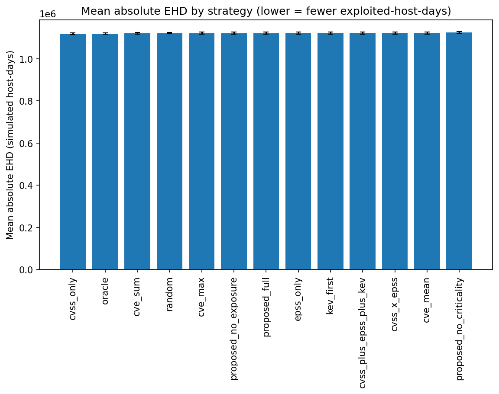
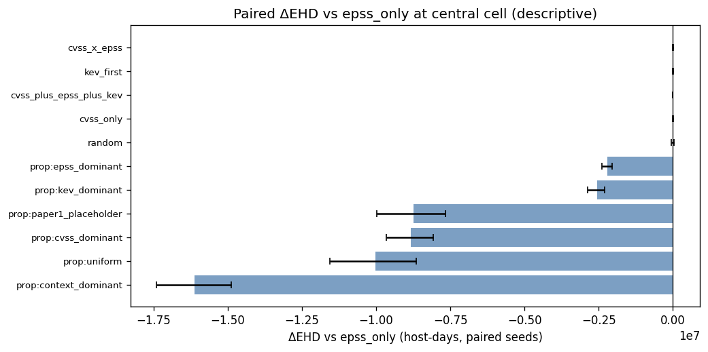
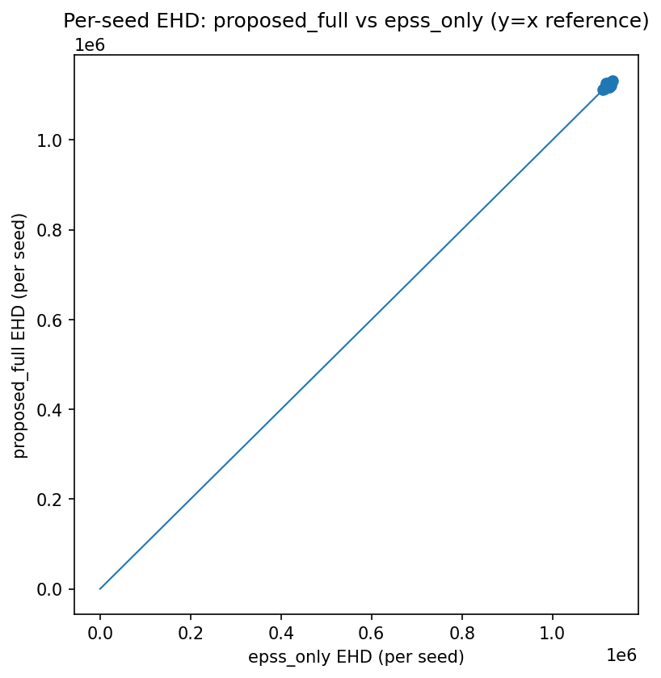
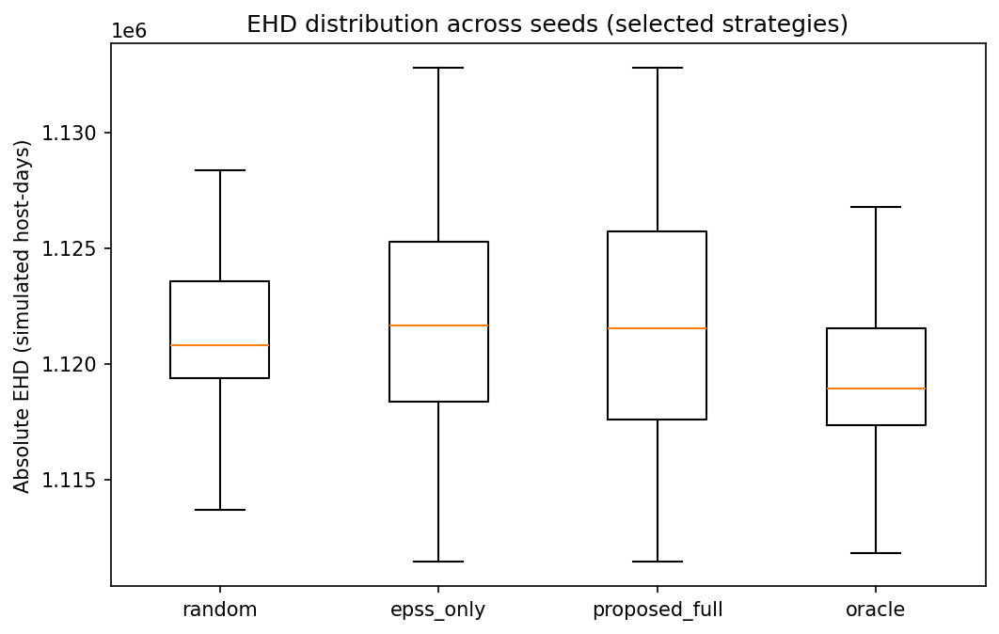
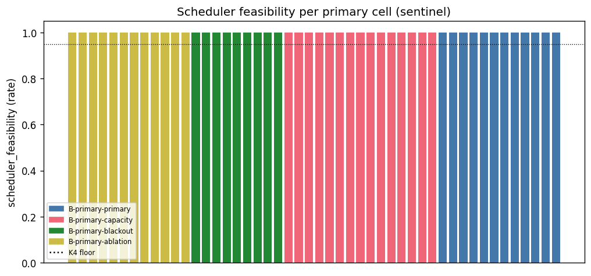

# Context-Aware Vulnerability Prioritization for Government Endpoint Fleets: Integrating Exploit Intelligence, Asset Criticality, and Endpoint Telemetry

**Harshavardhan Malla**, Independent Researcher

## Abstract

Government endpoint fleets face more disclosed vulnerabilities than they can
remediate within operational capacity, and prioritization decisions are often made
without traceable, reviewable evidence. We present an open, reproducible benchmark
framework for context-aware vulnerability-host *pair* prioritization that
integrates exploit-intelligence (EPSS, KEV, public proof-of-concept signals),
asset-criticality, and endpoint-exposure features, and that couples ranking with a
capacity-constrained scheduling simulation and an append-only, hash-chained audit
log of every decision. We evaluate the framework on a deterministic,
public-sector-shaped synthetic fleet using a frozen 30-seed artifact spanning 13
prioritization strategies and a simulated expected-exploited-host-days (EHD)
operational metric, with strict output inspection and a content-addressed
freeze/verify protocol. The evaluation checks artifact integrity end to end (4,290
metric rows with no missing or non-finite values; 390 audit logs that all verify;
feasible scheduling within capacity) and computes operational and ranking metrics
reproducibly from the frozen outputs. Under the current synthetic fixtures and
uncalibrated (placeholder) weights, the strategies are statistically
indistinguishable on EHD: the proposed context-aware model neither beats the EPSS
baseline nor a random ordering, and all inter-strategy differences fall within
seed-to-seed variation. These results expose capacity-driven and base-rate
trade-offs and, rather than establishing real-world superiority, provide a
falsifiable, audit-evidence-producing benchmark on which calibrated and externally
validated prioritization studies can build. *(All numeric values to be reconfirmed
against the released artifact before camera-ready.)*

**Keywords:** vulnerability prioritization; EPSS; KEV; risk-based vulnerability
management; reproducible benchmark; auditability; public-sector security operations.

## 1. Introduction

Public-sector endpoint fleets — the workstations, servers, domain controllers, and
special-purpose hosts operated by government agencies — accumulate disclosed
vulnerabilities faster than constrained operations teams can remediate them. The
publication rate of Common Vulnerabilities and Exposures (CVEs) continues to grow,
while each maintenance window admits only a bounded number of changes under
change-advisory, blackout, and approval constraints. The practical question is
therefore not *which vulnerabilities are severe* but *which vulnerability-host
pairs should consume the next unit of limited remediation capacity*, and *whether
that decision can be explained and reviewed afterward*.

Existing signals each address part of the problem. CVSS [1]
quantifies intrinsic severity but is a weak predictor of real-world exploitation
[3]. EPSS [2] estimates exploitation likelihood
but is asset-agnostic. The CISA KEV catalog [5] and Binding Operational
Directive 22-01 [6] impose deadlines on confirmed-exploited CVEs but
cover a small fraction of the backlog. Commercial risk-based vulnerability
management (RBVM) products combine such signals with proprietary asset context, but
their scoring is closed and not independently reproducible. Prior machine-learning
prioritization research advances modeling but typically reports a single tuned
result on private or non-reproducible data and rarely produces per-decision audit
evidence.

We do not claim a better predictor. We ask whether an open, reproducible,
audit-evidence-producing benchmark can be built that ranks vulnerability-host pairs
under public-sector-shaped operational constraints, and whether combining exploit
intelligence with asset criticality and endpoint exposure improves prioritization
over EPSS-style baselines — treated as an open empirical question. Our
contributions are (i) an integrated framework (feed normalization, exploit
enrichment, synthetic endpoint telemetry, asset-criticality and local-exposure
modeling, vulnerability-host pair construction, scoring/ranking strategies, a
capacity-constrained scheduling simulation, and append-only hash-chained audit
records); (ii) a deterministic, public-sector-shaped synthetic evaluation with a
frozen 30-seed artifact and an explicit freeze/verify integrity protocol; and (iii)
an honest empirical baseline. We state plainly that, under the current toy fixtures
and uncalibrated weights, the proposed model is statistically indistinguishable
from the EPSS baseline and does not outperform a random ordering. The value of the
work is the reproducible, falsifiable evaluation structure, not a superiority claim.

## 2. Background

**CVSS.** CVSS [1] scores intrinsic vulnerability characteristics; we
use a normalized base score as the severity feature and a `cvss_only` baseline,
noting its limited exploitation-predictive value [3].

**EPSS.** EPSS [2] estimates near-term exploitation probability and is
the strongest single public exploitation signal; it is asset-agnostic by design,
which asset-context features attempt to complement. It is our primary baseline.

**CISA KEV.** The KEV catalog [5] lists confirmed-exploited CVEs and, under
BOD 22-01 [6], assigns federal remediation deadlines used both as
features and as scheduler deadlines.

**The vulnerability-host pair.** Severity and exploitation likelihood are
CVE-level, but remediation is performed on a host. We adopt the pair (v, h) as the
unit of decision and explanation: the same CVE on a domain controller and a kiosk
are different decisions, which is what makes per-decision audit evidence
meaningful.

**Remediation capacity.** Teams remediate within bounded windows under blackout,
CAB cadence, and approval gates; any realistic evaluation must rank *and* schedule
under fixed capacity, since the binding constraint often dominates outcomes.

**Public-sector audit/compliance context.** Frameworks such as NIST SP 800-40
[7], NIST SP 800-53 [8], and CIS Controls [9]
emphasize documented, reviewable processes. Producing evidence that *supports
compliance review* is a first-class design goal, distinct from claiming compliance.

**Synthetic benchmarking.** Real agency telemetry is sensitive and rarely
shareable, impeding reproducibility. A deterministic synthetic fleet from
documented parameter distributions, combined with real public feeds, enables open,
repeatable evaluation; we are explicit that this bounds external validity (Section
11).

## 3. Related Work

**CVSS, EPSS, and exploit prediction.** CVSS alone poorly predicts exploitation
[3], motivating data-driven scoring including the EPSS lineage
[2] and earlier signal-based approaches [4].
We consume these as features/baselines rather than proposing a new predictor.

**Risk-based vulnerability management and commercial RBVM.** Commercial RBVM
products — Microsoft Defender Vulnerability Management, Tenable VPR/ACR, Qualys TruRisk, and Cisco/Kenna — combine exploit
signals with proprietary context. They are acknowledged as industry practice but
are **not** benchmarked here: their models are closed and not independently
reproducible.

**Machine-learning vulnerability prioritization.** Research systems such as Deep
VULMAN*(†)*, VulRG*(†)*, VulnScore*(†)*, and V-REx*(†)* apply learning and
risk/graph modeling to prioritization. They advance modeling quality but typically
report a single tuned configuration on non-reproducible data and do not emphasize
per-decision audit evidence or an open freeze/verify protocol. We position this
work as complementary infrastructure and do **not** claim to be first.

**Resource-constrained remediation.** Our scheduler models bounded per-window
capacity, blackout windows, approval policies, and risk acceptance, so strategies
are evaluated jointly with the operational constraints that shape real outcomes.

**Public-sector compliance and auditability.** Guidance such as NIST SP 800-40
[7] and SP 800-53 [8] and CISA directives [6]
frames remediation as a documented, reviewable process; our append-only,
hash-chained audit log targets the per-decision evidence such processes call for.

*† Citation omitted: bibliographic details of these systems could not be independently verified at time of writing.*

## 4. Problem Statement

Let `V` be the vulnerabilities observable as of a decision time `t0` and `H` the
hosts in a fleet. The candidate set of **vulnerability-host pairs** is
`P = {(v, h) : v in V, h in H, v applies to h}`, with applicability determined by
software/configuration matching. Each pair carries exploit-intelligence, severity,
asset-criticality, and local-exposure attributes observable at `t0` under strict
no-future-leakage (Section 7). A **strategy** induces a total order over `P`. A
maintenance window admits at most a fixed **capacity** `c` pair-actions, subject to
blackout windows, operational constraints, and approval gates. The **objective** is
to evaluate and compare strategies under this capacity constraint using operational
and ranking metrics (Section 9), recording each decision as tamper-evident
evidence.

**Non-goals.** We do not perform autonomous patching (the scheduler is a
capacity-constrained scheduling simulation modeling approval and timing, not patch
execution or success); we do not perform production validation (the fleet is
public-sector-shaped synthetic); we do not benchmark commercial RBVM products; and
we do not claim the framework guarantees or proves compliance — it produces
evidence that supports review.

## 5. Proposed Framework

The framework is a pipeline of composable components. **Feed normalization**
fetches public feeds (NVD/CVE, FIRST EPSS, CISA KEV, optionally ExploitDB
proof-of-concept indices subject to upstream license) and caches local snapshots
via date-parameterized as-of queries so no feature observed at `t0` incorporates
later information. **Exploit enrichment** attaches an EPSS score (feature `E`), KEV
status and due date (feature `K` and urgency component `U`), and proof-of-concept
observations used for labeling. A deterministic generator produces hosts with
roles, OS/software inventory, identity tiering, network zone, and data-sensitivity
proxies, from which we derive an **asset-criticality** feature `C` (incorporating
an Identity Privilege Exposure Score) and a per-pair **local-exposure** feature
`X`; a **remediation-complexity** feature `R` captures fix cost/risk.
**Pair construction** builds applicable (v, h) pairs with match-method and
match-confidence provenance, excluding future-disclosure vulnerabilities. A linear
model **scores** each pair as
`w_E·E + w_K·K + w_S·S + w_C·C + w_X·X + w_U·U − w_R·R` (R subtracted, since higher
complexity lowers priority), with weights from a registry of placeholder and (when
fitted) calibrated weights. A five-phase **capacity-constrained scheduler** fills a
window under capacity. Every score and scheduling decision is recorded in an
append-only, hash-chained **audit log**. An **evaluation** layer computes metrics
and a **reporting** layer renders tables/figures from a frozen, verified artifact.

## 6. System Architecture

The end-to-end pipeline is: public feeds (cached snapshots) → synthetic fleet
generation (hosts, criticality, exposure, complexity) → vulnerability-host pair
builder (no-future-leakage) → seven-feature frame (E, K, S, C, X, U, R) →
prioritization strategies (ranking) → capacity-constrained scheduler
(blackout/approval/risk) → append-only hash-chained audit logs → evaluation metrics
→ freeze and reporting (tables/figures). Two properties are central:
**tamper-evident audit logs** (each record's hash chains to its predecessor, so
post-hoc modification breaks verification), and **frozen outputs** (a completed
result set is sealed with a content-addressed freeze manifest of per-file SHA-256
hashes, and all tables and figures are generated only from a freeze-verified
artifact). Controlled execution is guarded so that large runs require explicit
confirmation, and per-seed checkpointing enables deterministic resume.

## 7. Methodology

The reported evaluation uses bundled toy fixtures (a small CVE/KEV/PoC set) with
the deterministic synthetic fleet generator; no live feeds are called and no
production data is used. Pairs are labeled over the half-open window
`(t0, t0 + H]`: Label A is positive if the CVE enters KEV or a public
proof-of-concept is first observed within the window; Label B is positive only on
proof-of-concept observation. Features are observation-only at `t0`; a temporal
train/gap/test split with an `H`-day gap prevents label leakage. The reported cell
uses Label A. When fitted, weights are calibrated with regularized logistic/ridge
regression under time-block cross-validation with negative-coefficient clipping;
the reported run uses **placeholder weights**, a deliberate, disclosed limitation
(Sections 11, 15). The cell comprises a 10,000-host fleet; capacity ratio 0.01
(capacity = max(1, floor(0.01 × 10,000)) = 100 pair-actions per window); Label A;
approver Policy A; the primary blackout configuration; the AD/Entra default
identity configuration; and 30 seeds. Thirteen strategies are evaluated: random,
cvss_only, epss_only, kev_first, cvss_x_epss, cvss_plus_epss_plus_kev, cve_max,
cve_mean, cve_sum, proposed_full, proposed_no_criticality, proposed_no_exposure,
and an evaluation-only oracle. A gradient-boosted-tree comparator is excluded
because no fitted model artifact was supplied. All randomness derives from a master
seed via SHA-256-based sub-seed derivation; the result is sealed with a freeze
manifest and passes strict structural inspection before any table or figure is
generated.

## 8. Synthetic Dataset Design

The fleet is generated from documented parameter distributions, not from any real
environment. Hosts are allocated across roles (e.g., standard workstation, member
server, domain controller, kiosk) with documented proportions and carry
network-zone, identity-tier, and data-sensitivity attributes. Each host is assigned
an OS and a software inventory from catalogs (determining vulnerability
applicability) and a patch state (allowing exclusion of already-remediated CVEs).
Telemetry-derived asset criticality combines role, identity privilege (an Identity
Privilege Exposure Score), network exposure, and data sensitivity into `C`; a
per-pair local-exposure feature `X` reflects component reachability on that host;
and a per-pair complexity feature `R` captures remediation cost and rollback risk.
Configurable CMDB staleness and telemetry-missingness rates model incomplete
observability; missing continuous features are imputed and a missing KEV status
defaults to zero with a recorded warning. Synthetic data is necessary because real
public-sector telemetry is sensitive and non-shareable; a documented generator
keeps the evaluation open and repeatable while we bound the external-validity
claims.

## 9. Evaluation Metrics

We report: **simulated expected exploited-host-days (EHD) and EEHDA** (for a
positive pair, days open after the label fires, bounded by the evaluation end;
lower is better; EEHDA expresses each strategy in absolute terms and relative to
random, relative to EPSS, and as a fraction of oracle headroom); **ranking
quality** (precision@k, recall@k, nDCG@k, censored labels excluded);
**KEV-deadline breach rate**; **capacity efficiency** (share of scheduled
non-censored pairs that are positives); **scheduler feasibility**;
**risk-acceptance rate**; and **audit integrity** (hash-chain validity and audit
record counts). Paired statistical comparison helpers — the Wilcoxon signed-rank
test [10], Holm-Bonferroni correction [11], and BCa bootstrap
confidence intervals [12] — are implemented; we do not apply them as
significance claims here because the observed differences are within seed-to-seed
noise (Section 13). This paper uses descriptive-only reporting: no hypothesis tests
are applied to the results, because the null result (no strategy is separable from
the others) is already evident from the overlapping per-seed distributions and the
sub-0.5% inter-strategy spread, which is smaller than the per-seed standard
deviation. Structural inspection (no duplicate rankings, contiguous ranks,
schedules subset of rankings, capacity respected, no infinite or
undocumented-NaN metrics) and content-addressed freeze verification gate the
results.

## 10. Compliance Mapping

The framework is designed to *support evidence for review* under common
public-sector control families; it does not satisfy or prove any control. We map
cautiously: NIST SP 800-53 RA-5 (vulnerability monitoring) [8] — 
pair-level prioritization and decision records support evidence for how findings
are triaged; SI-2 (flaw remediation) — scheduling/timing records support evidence
for remediation handling under capacity; CM-8 (component inventory) — the synthetic
inventory models the asset context such evidence depends on; AU-2/AU-3 (audit
events/content) — append-only, hash-chained records support evidence for auditable
event capture; NIST SP 800-40 Rev. 4 [7] — the scheduling simulation
reflects documented patch-management structure; CISA BOD 22-01 [6] —
KEV-deadline handling and breach metrics support evidence for directive-driven
prioritization; CIS Controls v8 [9] and the CJIS Security Policy
[13] — relevant control intent is acknowledged for
context. In every case the framing is "supports evidence for review," not
"satisfies" or "proves"; audit evidence is necessary for, but not equivalent to,
compliance.

## 11. Threats to Validity

The evaluation uses a synthetic fleet and a small bundled fixture set, so absolute
magnitudes are properties of these inputs. The proposed model used uncalibrated
placeholder weights, so no method-quality conclusion is possible until calibration
on historical exploitation data is performed. Inter-strategy differences are within
noise (sub-0.5% spread, smaller than per-seed standard deviation), so the study is
not powered to separate strategies. No live or production data was used, and no
commercial RBVM tool was compared. Only the single primary cell ran; Label B,
alternative policies/blackouts, and sensitivity sweeps remain future work. EPSS,
KEV, and PoC signals carry coverage/timing/labeling bias, and KEV/PoC-derived
labels are exploitation proxies rather than ground-truth compromise. Exposure and
criticality assume telemetry/CMDB observability that may be incomplete or stale.
The synthetic fleet may not reflect any specific agency. The scheduler models
approval and timing, not patch success/rollback. Under capacity constraints and the
current EHD accounting, the label-prioritizing oracle is not a strict EHD lower
bound, which is why some strategies report fraction-of-oracle values outside [0, 1];
these are reported as observed.

## 12. Original Contribution

The contribution is methodological infrastructure for falsifiable evaluation,
framed conservatively: (i) a **reproducible vulnerability-host pair benchmark** for
public-sector-shaped fleets with deterministic seeding and a frozen, verifiable
artifact; (ii) **audit-evidence-producing decision records** — an append-only,
hash-chained log whose integrity is independently verifiable, supporting
after-the-fact review (not a compliance determination); (iii) a
**capacity-constrained scheduling simulation** with blackout windows, an approval
policy, and documented risk acceptance, so prioritization is evaluated jointly with
operational limits (not autonomous remediation); (iv) a **frozen result artifact
and freeze/verify protocol** making every reported number traceable to a
content-addressed, integrity-checked output set; and (v) an **honest, neutral
empirical finding** — under toy fixtures and placeholder weights, the proposed model
is statistically indistinguishable from EPSS and does not outperform a random
ordering. This is explicitly not a claim of a superior model, not autonomous
remediation, and not a proof of compliance.

## 13. Results

All quantitative statements are taken from tables and figures generated from the
frozen artifact (30 seeds, 13 strategies; freeze verified — see Appendix A). EHD is
a simulated operational quantity for which lower is better.

**13.1 Experimental integrity and artifact validation.** The evaluation comprises
30 seeds, 13 strategies, and 11 metrics per (seed, strategy) cell — 4,290 per-seed
metric rows (Table 1) — and 390 hash-chained audit logs, all of which verify.
Strict inspection reported zero issues, the freeze manifest verifies, there are no
NaN and no infinite values, and the per-window capacity (100 pair-actions) is
respected by every strategy in every seed.

**13.2 Operational EHD outcomes.** Mean absolute EHD (Table 2; Figures 1 and 4)
clusters around ~1.12 × 10⁶ simulated host-days for all strategies. The nominal
ordering (best/lowest first) places cvss_only (1.1190 × 10⁶) and oracle
(1.1193 × 10⁶) at the low end and proposed_no_criticality (1.1243 × 10⁶) at the
high end; the total spread across all 13 strategies is about 5.3 × 10³ host-days
(under 0.5% of the mean) while per-strategy standard deviations are ~3.4-5.2 × 10³
(≈0.3-0.5%). The strategies are therefore not separable by absolute EHD.
proposed_full (1.1217 × 10⁶) is marginally above (worse than) random
(1.1213 × 10⁶) and marginally below (better than) epss_only (1.1219 × 10⁶); neither
gap is meaningful at this noise scale. cvss_only records a slightly lower mean EHD
than oracle; because the oracle is a label-prioritizing ranker rather than a
closed-form EHD minimizer under capacity constraints, and the gap (~0.03%) is far
inside the noise band, we treat the ordering as effectively flat (Section 11).

**13.3 Relative performance against EPSS.** Table 3 and Figure 3 express each
non-oracle strategy relative to epss_only; lower EHD is better, so a negative delta
is an improvement. Several strategies show nominally lower EHD than epss_only
(cvss_only −0.26%, cve_sum −0.11%, random −0.056%, cve_max −0.050%,
proposed_no_exposure −0.030%, proposed_full −0.017%); others are nominally worse;
kev_first equals epss_only. proposed_full's nominal improvement (~0.017%, ~186
host-days) is an order of magnitude smaller than the seed standard deviation and is
not evidence of beating EPSS; random also appears nominally "better than EPSS" by a
similar margin, confirming these sub-0.1% gaps are noise (Figure 5).

**13.4 Fraction-of-oracle analysis.** Figure 2 and the fraction-of-oracle column of
Table 2 place each strategy on the random(0)-to-oracle(1) scale. Observed values
fall outside [0, 1] for several strategies (cvss_only 1.18; proposed_full −0.23);
values below 0 indicate worse-than-random behavior under this metric, and a value
above 1 most plausibly reflects a metric/artifact effect (the oracle is not a
strict lower bound under capacity here) rather than a genuine result. They are
reported as observed; given the within-noise spread the scale is not a reliable
ranking signal in this run.

![Figure 2: Fraction-of-oracle scale for all 13 strategies. Values outside [0,1] reflect metric artifacts under capacity constraints, not genuine performance.](../figures/fig_fraction_of_oracle.png)

**13.5 Ranking metrics.** Table 4 reports precision@k, recall@k, nDCG@k (k = 10).
oracle and cvss_only achieve perfect precision@10 and nDCG@10 (1.0); proposed_full
records precision@10 = 0.687 and nDCG@10 = 0.690, between epss_only (0.633) and
random (0.727). random's top-10 precision exceeds proposed_full's, indicating that
under the toy fixtures (small CVE catalog, high positive base rate) top-k precision
does not discriminate between methods; recall@10 is uniformly small (~5 × 10⁻⁴) by
construction. No ranking-quality superiority claim is drawn.

**13.6 Operational and audit metrics.** From Table 5: scheduler feasibility is 1.0
everywhere; scheduled count equals capacity (100) throughout (capacity binding);
capacity efficiency ranges 0.30-1.0 with proposed_full at 0.65 (below random's 0.73
and cvss_only/oracle's 1.0); KEV-deadline breach rate is uniformly high
(~0.985-0.996), dominated by the capacity constraint rather than the policy;
risk-acceptance rate is near zero. From Table 6: every strategy's audit log has a
valid hash chain (1.0); audit record counts vary (~101-292).

**13.7 Summary.** The benchmark executes reproducibly (4,290 integrity-verified
rows, 390 valid audit logs); the audit and scheduler pipeline behaves correctly end
to end; the oracle/random bounds are nearly flat and metrics are dominated by the
capacity constraint and the toy-fixture base rate; the proposed model did not
dominate the baselines (indistinguishable from epss_only, nominally worse than
random on EHD, capacity efficiency, and top-10 precision); and the artifact
exposes measurable operational trade-offs and provides a reproducible, auditable
basis for calibrated and sensitivity studies.

## 14. Discussion

The evaluation demonstrates the feasibility of an end-to-end,
audit-evidence-producing benchmark for vulnerability-host pair prioritization under
capacity constraints: a 30-seed simulation runs deterministically and reproducibly;
the scheduler and append-only hash-chained audit log operate correctly across all
strategies and seeds; and operational quantities are computed from a frozen,
integrity-verified artifact. The results do **not** establish real-world
superiority of any strategy, do **not** show that proposed_full beats EPSS or
random, do **not** demonstrate autonomous remediation, do **not** prove compliance,
and do **not** constitute production validation. A benchmark that can show *when
added host context does not help* is more valuable than one tuned to confirm a
hypothesis: the finding that uncalibrated context-aware weights do not separate
from EPSS under toy inputs sets a clear falsification condition and motivates
calibrated, larger-window evaluation. Three structural points hold independent of
the (inconclusive) method comparison: per-decision audit records and verifiable
hash chains provide a traceable basis for review; capacity constraints and approval
gates materially shape outcomes (here capacity, not policy, dominated KEV breach);
and the vulnerability-host pair is a useful, traceable unit of decision and
explanation. This work complements prior context-aware/learning-based
prioritization such as Deep VULMAN*(†)*, VulRG*(†)*, and VulnScore*(†)* by emphasizing a
reproducible, public-sector-shaped benchmark with per-decision audit evidence and a
freeze/verify protocol, rather than a single tuned result; it does not claim to be
first.

## 15. Limitations

The evaluation is synthetic and toy-fixture-based; the proposed model used
uncalibrated placeholder weights; inter-strategy differences are within noise; no
live or production data was used; no commercial RBVM baseline was compared; no
robustness or sensitivity sweeps were run; EPSS/KEV/PoC signals and labels carry
bias and are exploitation proxies; exposure/criticality assume telemetry
observability that may be incomplete; the synthetic fleet may not generalize to any
specific agency; audit evidence is not compliance; the scheduler models timing, not
patch success; the oracle is not a strict EHD lower bound under capacity; and the
gradient-boosted-tree comparator was excluded for lack of a fitted artifact.

## 16. Future Work

Future work includes calibrated weights over larger historical windows; Label B /
PoC-only robustness runs; sensitivity sweeps over capacity ratio, blackout,
approver policy, identity configuration, CMDB staleness, and telemetry missingness;
point-in-time public-feed snapshots beyond toy fixtures; a real-agency pilot under
anonymized, approved telemetry with governance review; additional learning-to-rank
baselines and the gradient-boosted-tree comparator once fitted; audit-quality
metrics (explanation completeness, imputation rate) in the primary metric set with
automated model-card/audit-report generation; richer blackout/CAB models,
patch-success/rollback in the EHD accounting, and a corrected oracle; a power
analysis to size seeds and effects; and public release of the reproducibility
artifact.

## 17. Conclusion

We proposed and implemented an open, audit-evidence-producing benchmark framework
for context-aware vulnerability-host pair prioritization under capacity
constraints. The evaluation demonstrates reproducible end-to-end execution across
30 seeds and validates the artifact's inspection, scheduling, and append-only audit
pipeline: 390 audit logs verify, scheduling stays within capacity, and the frozen
result passes strict inspection with zero issues. The empirical results should be
read as benchmark validation under synthetic, toy-fixture conditions with
uncalibrated weights, not as evidence of real-world superiority; in this
configuration the proposed model is indistinguishable from the EPSS baseline and
does not outperform a random ordering. The primary contribution is the reproducible,
auditable evaluation structure itself — a falsifiable basis on which calibrated,
production-scale studies can build. Whether context-aware prioritization yields
operational benefit over EPSS-style baselines remains future work requiring
calibration, robustness and sensitivity analysis, and external validation.

## References

[1] Forum of Incident Response and Security Teams (FIRST). *Common Vulnerability Scoring System Version 3.1: Specification Document*. FIRST.org, 2019. https://www.first.org/cvss/v3.1/specification-document

[2] J. Jacobs, S. Romanosky, B. Edwards, M. Roytman, and I. Adjerid. "Exploit Prediction Scoring System (EPSS)." *Digital Threats: Research and Practice*, 2(3):14:1–14:17, 2021. DOI: 10.1145/3474369

[3] L. Allodi and F. Massacci. "Comparing Vulnerability Severity and Exploits Using Case-Control Studies." *ACM Transactions on Information and System Security*, 17(1):1:1–1:20, 2014. DOI: 10.1145/2576752

[4] C. Sabottke, O. Suciu, and T. Dumitraș. "Vulnerability Disclosure in the Age of Social Media: Exploiting Twitter for Predicting Real-World Exploits." In *Proc. 24th USENIX Security Symposium*, pp. 1041–1056, 2015.

[5] Cybersecurity and Infrastructure Security Agency (CISA). *Known Exploited Vulnerabilities Catalog*. 2021. https://www.cisa.gov/known-exploited-vulnerabilities-catalog

[6] Cybersecurity and Infrastructure Security Agency (CISA). *Binding Operational Directive 22-01: Reducing the Significant Risk of Known Exploited Vulnerabilities*. 2021. https://www.cisa.gov/binding-operational-directive-22-01

[7] M. Souppaya and K. Scarfone. *Guide to Enterprise Patch Management Planning: Preventive Maintenance for Technology*. NIST Special Publication 800-40 Revision 4. National Institute of Standards and Technology, 2022. DOI: 10.6028/NIST.SP.800-40r4

[8] Joint Task Force. *Security and Privacy Controls for Information Systems and Organizations*. NIST Special Publication 800-53 Revision 5. National Institute of Standards and Technology, 2020. DOI: 10.6028/NIST.SP.800-53r5

[9] Center for Internet Security. *CIS Critical Security Controls Version 8*. 2021. https://www.cisecurity.org/controls/v8

[10] F. Wilcoxon. "Individual Comparisons by Ranking Methods." *Biometrics Bulletin*, 1(6):80–83, 1945. DOI: 10.2307/3001968

[11] S. Holm. "A Simple Sequentially Rejective Multiple Test Procedure." *Scandinavian Journal of Statistics*, 6(2):65–70, 1979.

[12] B. Efron. "Better Bootstrap Confidence Intervals." *Journal of the American Statistical Association*, 82(397):171–185, 1987. DOI: 10.1080/01621459.1987.10478410

[13] Federal Bureau of Investigation. *Criminal Justice Information Services (CJIS) Security Policy*. Version 5.9.4. U.S. Department of Justice, 2023. https://www.fbi.gov/file-repository/cjis-security-policy-v5-9-3-01272023-1.pdf

## Appendix A. Reproducibility and Provenance

All numeric results derive from a single frozen artifact produced by the
reference implementation: a 30-seed run over 13 strategies, sealed with a
content-addressed freeze manifest (per-file SHA-256) and verified prior to table
and figure generation. The run used bundled toy fixtures and the deterministic
synthetic fleet generator with no live feed calls and no production data. Tables
1-6 (and supplementary Table A1) and Figures 1-5 are generated programmatically
from the frozen metric frames; their source files and captions are catalogued in
the accompanying table/figure index. Integrity checks: 4,290 metric rows, 0 NaN, 0
infinite values, 390 audit logs all hash-chain-valid, max scheduled count equal to
the configured capacity (100), strict inspection passed with zero issues.
