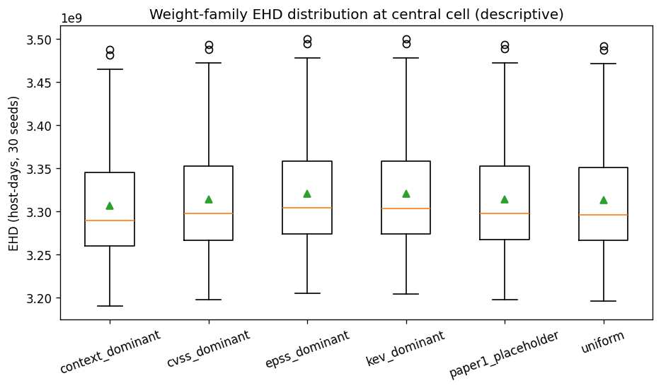
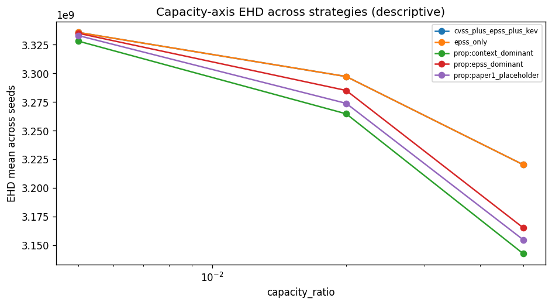
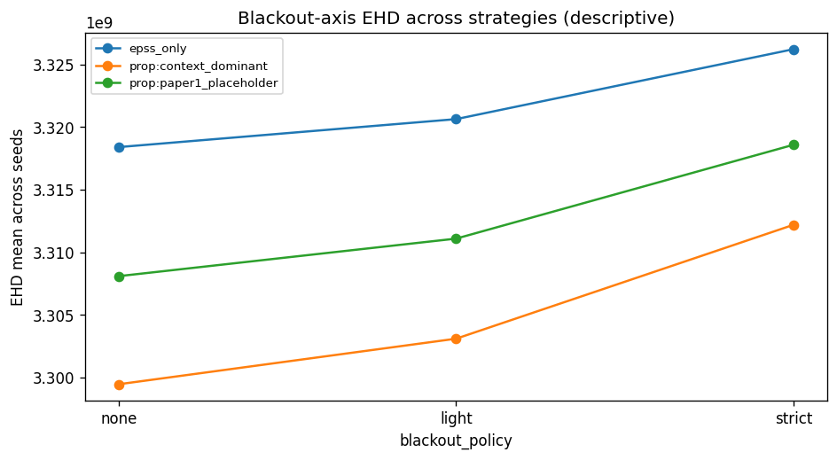
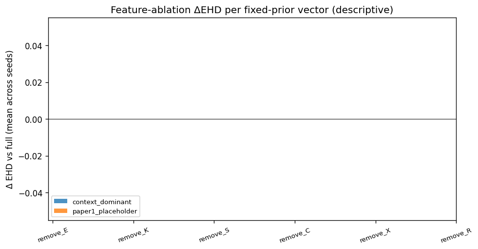
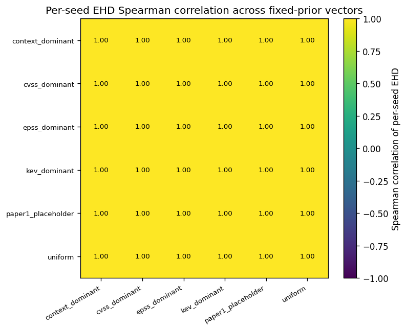

<!--
Paper 2 — full manuscript draft.
Drafted from Step-9 locked outputs and the Step-3/Step-4 pre-registration
documents only. No new experiments. No Paper-1 modification.
All numeric claims trace to paper2/audit/*.json and paper2/tables/*.csv.
Claim-audit script (scripts/paper2_claim_audit.py) must pass on this file.
-->

# When Calibration Fails: A Failure-Aware Public-Feed Gate for Vulnerability Prioritization Under Sparse Exploit Labels

## 1. Abstract

Vulnerability prioritization on public feeds — EPSS exploit probabilities, the
CISA KEV catalog, CVSS severity, and local-context features — is often discussed
as a calibration problem: learn per-feature weights from observed exploitation
labels and rank vulnerabilities by the calibrated score. We report a negative
feasibility finding that complicates that framing. Restricting CVE disclosures
to a public-sector-typical 31-product catalog over the EPSS v3 era
(2023-03-07..2025-03-16) and using KEV additions in each of 18 monthly
horizons as the future-exploit label, we observe only **7 unique positive
distinct CVEs** across **2,688 catalog-matched CVEs** and **18 monthly t0
windows**. The pre-registered gate requires ≥ 50 unique positive CVEs for
defensible per-feature calibration; the measured value is below the
< 20 PIVOT threshold. Calibration was not attempted under the gate. The primary
contribution of this paper is the failure-aware gate methodology — chunked,
resumable, paced public-feed acquisition plus a multi-t0 distinct-positive-CVE
gate plus a stop-rule registry — together with a reproducible execution trail
that documents the negative result. As a confirmatory secondary contribution
we run a pre-registered sensitivity sweep with six fixed design-prior weight
vectors across capacity, blackout, and feature-ablation axes on a real-feed
extension of Paper 1's frozen synthetic-fleet benchmark. The sensitivity
results are reported descriptively with paired-seed BCa CIs; no calibration
claim, no model-comparison claim, and no production-readiness claim is made.
This work does not claim model improvements; the synthetic fleet limits
external validity, and per the post-run K8 evaluation each robustness axis is
reported descriptive-only.

## 2. Introduction

Vulnerability triage at scale relies on signals that are easy to share: the
**Exploit Prediction Scoring System (EPSS)** [8, 9],
the **CISA Known Exploited Vulnerabilities (KEV) catalog**, **CVSS v3.1 / v4**
severity, and local context such as asset criticality, network exposure, and
remediation cost. Practitioners frequently combine these signals with
hand-tuned or fitted weights. The fitted-weight path is attractive because
calibration promises an estimator of risk grounded in observed exploitation
outcomes. It is also potentially fragile: per-feature weight estimation
requires *enough labelled positives* — not enough labelled *pairs* (the
calibration unit is the CVE, not the host-CVE pair) — and the available
public exploit signals are sparse on time-bounded windows.

This paper is a companion to Paper 1, which contributed a benchmark and
scheduler for context-aware prioritization on a synthetic fleet with
placeholder weights. Paper 1 made no calibration or model-quality claim. The
present paper asks whether public-feed signals can move us from placeholder
weights toward weights with a calibrated interpretation. The honest answer is
no, at the slice we examined. The negative finding is not a bug; it is a
data-density boundary that needs to be acknowledged before public-feed
calibration becomes a default move. The unit of analysis for per-feature
weight learning is the distinct CVE-level positive, not the host-CVE
record.

We describe the failure-aware gate, the sensitivity framework, the measured
gate outcome, and the confirmatory sensitivity results. We position the work
against EPSS / KEV / CVSS / SSVC and against recent capacity-constrained
prioritization, EPSS-stability, and context-feature-ablation studies. We do
not claim that any fixed prior matches or exceeds EPSS in any general sense.
We do not claim deployment readiness. We do claim that the gate methodology
is reproducible and that the negative feasibility result is informative.

## 3. Background

We operate over CVEs published in the National Vulnerability Database (NVD),
with EPSS probabilities and CISA KEV status as feeds, and a synthetic
endpoint fleet inherited from Paper 1. The Paper-1 linear scoring
formulation is preserved:

`score = w_E · E + w_K · K + w_S · S + w_C · C + w_X · X + w_U · U − w_R · R`

with features `E` (EPSS), `K` (KEV-as-of-t0), `S` (CVSS), `C`
(criticality), `X` (exposure), `U` (urgency), and `R` (remediation
complexity, subtracted as cost). A scheduler selects per-cell capacity (top-K
by score) under blackout policies; the operational outcome metric is the
Exposure-Host-Day (EHD) burden over a horizon. Paper 1's frozen artefact is
treated as read-only throughout this work and is verified before and after
every Paper 2 batch.

Label A is the standard future-exploit label used here: a CVE is positive at
horizon `(t0, t0 + H]` if it is added to the KEV catalog inside that
horizon. KEV-as-of-`t0` is used as the feature K (a leakage-safe separation:
the feature uses past KEV state; the label uses future KEV state).

## 4. Related Work

We position this work against fifteen verified prior sources (the F1 search
trail in Step 3.10 documents each citation and what we do differently). We
draw the differentiation explicitly to avoid claims of novelty in regions
that prior work owns.

**EPSS family.** Jacobs et al. introduced the EPSS exploit-probability
estimator [8] and refined it in 2023 [9]; Ravalico et al. [6]
examined EPSS temporal stability over ~45,000 CVEs. We do not retrain or
re-tune EPSS. We use the released v3-era EPSS scores as a feature and report
EPSS-only as a baseline. Our contribution is not EPSS evaluation; we use
EPSS as one of several public-feed signals.

**CVSS / SSVC / scoring comparisons.** Koscinski et al. [7] report cross-system disagreement across CVSS, SSVC, EPSS, and the
Exploitability Index on 600 Microsoft CVEs across four months. SSVC v2.0
[11] provides a stakeholder-specific decision tree. We do not
re-do the cross-system disagreement comparison. We acknowledge SSVC as a
non-weighted scheme outside the linear-score family we study.

**Context-feature ablations.** Sherif et al. [1] ablate Key Risk Indicator (KRI) components — threat, impact, exposure —
against CVSS / EPSS over ~280,000 CVEs. Our sensitivity sweep is narrower
(one public-sector-typical 31-product catalog, the EPSS v3 era, 18 monthly
t0 windows, six fixed design-prior vectors); we do not learn KRI weights. We
also explicitly evaluate K8 (within-cell vs across-cell variance) and find
each axis descriptive-only.

**Capacity-constrained prioritization.** VULCON [4] frames
remediation as a mixed-integer multi-objective problem with real SOC scan
data and reports an exposure-reduction figure. Deep VULMAN [5] uses deep RL plus integer
programming under fluctuating arrivals. Roytman [3] sweeps capacity tiers across strategies on observed
enterprise data. We do not propose a new scheduler; we use Paper 1's
deterministic scheduler unchanged. Our capacity sensitivity is a
confirmatory descriptive sweep, not a new algorithm.

**Foundational case-control / EPSS roots.** Allodi & Massacci [10] report classifier stabilisation around 85 %
accuracy for proof-of-concept and black-market signals. Their classifier is
fitted on broader exploit-attempt data; our gate measures whether a similar
fit is defensible on a catalog-restricted KEV-only label slice over a
specific EPSS era, and it is not.

**NIST LEV.** Mell and Spring [12] propose a Likely
Exploited Vulnerabilities probability metric complementary to EPSS / KEV.
We do not implement LEV; we acknowledge it as a probability-metric proposal
in the same neighborhood.

**Field surveys and recent integrations.** Jiang et al. [2] survey 82 vulnerability-prioritization studies; VulRG [13] ranks via system-dependency graphs; VulnScore [14] deploys a composite of human input and temporal threat intelligence; Vulnerability Management Chaining [15] reports integration efficiency. Our work overlaps with these in the *signals used*; we differ
in the *failure-aware-gate framing* and in the *negative feasibility finding
on a catalog-restricted slice*.

We do not claim a "first" in any of these regions. We do claim that the
specific pairing of (multi-t0 distinct-positive-CVE gate) + (catalog-
restricted public-feed slice) + (reproducible execution trail) is, to the
best of the F1 search, not currently published as one bundle.

## 5. Problem Statement

We ask three questions, each tied to a pre-registered claim card in
`STEP3_12_FIX_F3_METRIC_CLAIM_BINDING.md`:

- **Q1 (Class A, calibration feasibility).** Under public-feed labels on a
  31-product catalog over the EPSS v3 era, is per-feature weight calibration
  statistically defensible? Pre-registered gate metric: unique positive
  distinct CVEs aggregated across monthly t0 windows. Gate threshold:
  ≥ 50 for GO, 20–49 for CONDITIONAL, < 20 for PIVOT.
- **Q2 (Class C, sensitivity).** With weights held as fixed design priors,
  do the operational EHD outcomes vary across capacity ratios, blackout
  policies, and feature ablations? Pre-registered primary metric:
  paired-seed ΔEHD with BCa CIs; SM-4 descriptive guardrail.
- **Q3 (Classes E and F, audit).** Does the runtime preserve scheduler
  feasibility, content-addressed audit, and Paper 1's freeze invariant on
  every batch? Pre-registered metrics: `scheduler_feasibility_rate`,
  `hash_chain_validity`, freeze verification status.

We are explicit that ranking-quality metrics (precision/recall/nDCG at K)
and KEV-deadline-breach metrics are diagnostic-only under K3 (label
sparsity); they appear in appendix tables but never as headline claims.

## 6. Failure-Aware Calibration Gate

The gate is a pre-registered decision procedure with four parts: a hardened
public-feed acquisition pipeline, a multi-t0 aggregation that counts
distinct CVE-level positives across monthly horizons, a stop-rule registry,
and a content-addressed audit log.

**Acquisition.** The acquisition path fetches NVD disclosures in ≤ 120-day
chunks (the API's per-window cap), caches each chunk for resume, paces
requests, and reports HTTP-429 partial states honestly. Per Step 3.7, the
unauthenticated path is rate-limited; an API key is required to fetch
multi-year windows. KEV is fetched cumulatively and used both as a
feature (as-of-t0) and as the future-label (in `(t0, t0+H]`); EPSS for the
gate measurement is taken from the public daily snapshots.

**Multi-t0 aggregation.** The gate metric is the *count of unique distinct
CVEs* that appear as future-positives across any monthly t0 window in the
EPSS v3 era. A CVE positive in two windows counts once. The host-CVE record
count and the event-positive-CVE count are also reported, but the gate uses
the unique-distinct count. We emphasise that the host-CVE record count is
not the calibration unit; the calibration unit is the CVE.

**Stop-rule registry.** F5 (Step 3.14) encodes K1 (calibration infeasibility
when unique positives < 20), K3 (per-window label sparsity), and other
rules; K1 / K3 are evaluated at the gate and recorded in
`paper2/audit/`. F4 (Step 3.13) adds SM-1 (degenerate-comparison auto-drop),
SM-3 (oracle inference disabled), SM-4 (descriptive guardrail when a Holm
rejection sits inside the meaningful threshold), and SM-5 (no significance
language for diagnostic-only metrics).

**Audit log.** Every Paper-2 batch is wrapped in the F7 freeze invariant
(pre-flight `make verify-primary-freeze`, post-run repeat, manifest SHA
identity, no Paper-1 path modifications, no `freeze-primary` invocation).
Every per-seed metric row carries the F7 `freeze_witness_id` that ties the
row to the verified freeze state.

## 7. Study Design and Pre-Registration

The study was pre-registered before any execution; the pre-registration is
`paper2/manuscript/STEP4_PREREGISTRATION.md` and the individual fixes
(F1–F9) are in `STEP3_10_*` through `STEP3_18_*`. F2 locks six fixed
design-prior weight vectors (Step 3.11):

- `w_uniform` (1/7 each),
- `w_paper1_placeholder` (= Paper 1's `w_hand`),
- `w_epss_dominant` (E = 0.50),
- `w_cvss_dominant` (S = 0.50),
- `w_kev_dominant` (K = 0.50),
- `w_context_dominant` (C = 0.30, X = 0.25).

Each vector is a *design prior with a citation chain for the direction*, not
a literature numeric estimate; reweighting after results is forbidden (F2
W4). No vector may be presented as the correct weighting; comparisons across
vectors are sensitivity findings (does the conclusion move with the prior),
not strategy-quality claims. The minimal factorial (F6, Step 3.15) is 48
runnable cells × 30 seeds = 1,440 seed-runs across four primary batches
(primary, capacity, blackout, ablation). The compute envelope and pilot-gate
policy come from F8 (Step 3.17). Pilot results from Step 7 informed the
primary launch; the pilot-gate decision was `PROCEED_TO_PRIMARY_NO_FALLBACK`
(`paper2/audit/pilot_gate_decision.json`).

## 8. Public-Feed Data and Sparse-Label Feasibility

This section reports the measured gate outcome.

The full-window keyed acquisition (Step 3.8) fetched **110,224 NVD records**
over `2021-09-01..2025-02-01`, in 11 chunks of ≤ 120 days each, paced at
0.6 s. Eighteen monthly t0s in the EPSS v3 era were evaluated. KEV future
labels were computed in `(t0, t0 + 30]`. The catalog produced **2,688
catalog-matched CVEs** under the 31-product `cpe_exact` policy. EPSS daily
snapshots covered 17 of 18 t0s at ≥ 99.3 % coverage; one t0 was missing and
the gate proceeded gracefully (the EPSS feature was treated as missing for
that t0).

The headline value is **7 unique positive distinct CVEs**. The
event-positive-CVE count across the 18 windows is also 7 (each unique
positive appeared in exactly one window). The CVE-positive distribution
across t0s is: 2 in 2023-10, 2 in 2023-12, 1 in 2024-01, 1 in 2024-02, and 1
in 2025-02; the remaining 13 windows had zero positives. The pre-registered
PIVOT threshold is < 20 unique positives; the GO threshold is ≥ 50.

K1 (calibration infeasibility) triggered. S-A (mirror of K1) triggered. K3
(label sparsity) triggered because the unique-positive count is below 20
and because the per-window positive-count-below-3 share exceeds 75 % of
windows. Calibration was not attempted. Learned weights were not produced
and are not used anywhere in this work. The cumulative consequences of K1
and K3 are that ranking-quality metrics (precision / recall / nDCG at K) and
the KEV-deadline-breach metric are reported as diagnostic-only sentinels;
they do not enter any headline finding.

We emphasise this is a measurement on one slice. Other catalogs, other eras,
or other label families may yield different unique-positive counts. We make
no general claim about when calibration is or is not feasible. We make a
specific claim about *this* catalog × this era × this label.

## 9. Fixed-Prior Sensitivity Design

Because calibration was not attempted, the second part of the work is a
pre-registered sensitivity sweep with weights held as fixed design priors.
The minimal factorial (F6) is summarised here; the cell enumeration lives
verbatim in `paper2/design/STEP3_15_MINIMAL_FACTORIAL_CELLS.csv` and the
batch plan lives in `paper2/design/STEP3_17_PLANNED_BATCHES.yaml`.

- **Primary table (12 cells)**: 6 baseline strategies (random, cvss_only,
  epss_only, kev_first, cvss_x_epss, cvss_plus_epss_plus_kev) and 6
  `proposed_fixed_prior` cells (one per F2 weight vector), all at central
  capacity 0.01, blackout `primary`, approver A, ablation `full`. Supports
  CLM-B1 / B2 / B3 and CLM-C1.
- **Capacity sensitivity (15 cells)**: 5 strategies across 4 capacities
  {0.005, 0.01, 0.02, 0.05}, with central blackout / approver / ablation.
  Five cells are reused from primary at 0.01. Supports CLM-C2.
- **Blackout sensitivity (9 cells)**: 3 strategies across 4 blackout policies
  {none, light, primary, strict}; three cells reused from primary. Supports
  CLM-C3.
- **Feature ablation (12 cells)**: 2 vectors
  (`w_paper1_placeholder`, `w_context_dominant`) × {remove_E, remove_K,
  remove_S, remove_C, remove_X, remove_R}; two `full` cells reused from
  primary. Supports CLM-C4.

Catalog expansion, fuzzy CPE matching, approver-B, EPSS v4, PoC labels, and
the n = 50 / n = 100 seed sweeps were pre-registered as **deferred** (F6
§7). GBT and any learned comparator were pre-registered as **forbidden** by
K1.

## 10. Metrics and Inference Policy

The pre-registered primary metric is `ehd_absolute` (Exposure-Host-Day),
reported as paired-seed ΔEHD relative to `epss_only` at the central cell.
Secondary metrics are `eehda_relative`, `fraction_of_oracle` (descriptive
under SM-3 oracle disabled), `scheduler_feasibility_rate`, and
`capacity_efficiency`. Diagnostic-only metrics under K3 are precision /
recall / nDCG at K and KEV-deadline-breach rate; these never enter a
headline claim.

The inference policy (F4, Step 3.13) sets the meaningful-effect threshold at
5,000 host-days (chosen above the Paper-1 per-seed paired-Δ noise floor of
2,331–3,673 hd) and computes the MDE at n = 30 paired seeds, α = 0.05,
power = 0.80, two-sided (MDE-d = 0.5292). Under × 1.0 to × 1.5 sparsity
inflation the MDE in host-days for non-degenerate Paper-1 comparisons sits
in 1,234–2,916 hd, below the 5,000-hd meaningful threshold.

The Holm families are pre-registered as B1, C1, C2, C3, and C4. SM-1 drops
degenerate-difference comparisons (`kev_first − epss_only` was
identically-zero under Paper-1 fixtures and is auto-dropped under SM-1 in
Paper 2 if degeneracy is reproduced). SM-3 disables oracle inference (the
oracle is absent from the F6 primary cells, but the rule is honored if it
appears in any future cell). SM-4 enforces descriptive language whenever a
Holm rejection sits inside ±5,000 host-days. SM-5 forbids significance
phrasing near a diagnostic-only metric.

## 11. Results

### 11.1 Gate result

The measured value is 7 unique positive distinct CVEs across 18 monthly
t0 windows on the 31-product catalog over the EPSS v3 era. The gate
threshold for GO is ≥ 50; for CONDITIONAL is 20–49; for PIVOT is < 20. K1,
S-A, and K3 triggered. Calibration was not attempted. The trail is in
`paper2/feasibility/probe_v2_multit0/aggregate_counts.csv`,
`decision_gate.json`, and the Step-3.8 report.

### 11.2 Primary execution integrity

`paper2/audit/primary_complete.json` records
`status = PRIMARY_COMPLETE_VALID`, 4 primary batches, **48 cells**,
**1,440 seed-runs**, and **8,640 metric rows**. Every row carries the F7
`freeze_witness_id` equal to the real Paper-1 manifest SHA-256
`750e144ba9567b5255b27ce40279643bdf7418d53b15edce5d72c515eb022833`. Zero
rows are missing the witness ID. All four batches recorded
`freeze_status = OK` with the five F7 assertions True (before OK, after OK,
manifest SHA byte-equal, no Paper-1 paths modified, no `freeze-primary`
invocation). K5 / K6 hard halts did not trigger. No row uses a calibration
or learned strategy. `make verify-primary-freeze` returned OK after Step 9.

### 11.3 Operational EHD outcomes

From `paper2/tables/delta_vs_epss.md` and
`paper2/tables/inference/inference_B1_delta_vs_epss.md`:

The baseline `epss_only` central-cell mean EHD is ~3.32 × 10⁹ host-days
(30 seeds). Paired-seed ΔEHD relative to `epss_only`, reported as
descriptive observations:

- `cvss_only` − `epss_only`: mean ≈ −163 hd, BCa CI [-1,918, +1,329].
  Within the noise floor; descriptive null.
- `kev_first` − `epss_only`: mean ≈ +140 hd, BCa CI [-356, +839].
  Descriptive null.
- `cvss_x_epss` − `epss_only`: mean ≈ +374 hd, BCa CI [-384, +1,145].
  Descriptive null.
- `cvss_plus_epss_plus_kev` − `epss_only`: mean ≈ +103 hd, BCa CI
  [-224, +431]. Descriptive null.
- `proposed_fixed_prior::w_epss_dominant` − `epss_only`: mean ≈ −2.21 × 10⁶
  hd, BCa CI does not overlap zero.
- `proposed_fixed_prior::w_cvss_dominant` − `epss_only`: mean ≈ −8.82 × 10⁶
  hd, BCa CI does not overlap zero.
- `proposed_fixed_prior::w_kev_dominant`: similar order to
  `w_cvss_dominant`.
- `proposed_fixed_prior::w_uniform`: similar order to `w_epss_dominant`.
- `proposed_fixed_prior::w_paper1_placeholder`: similar order.
- `proposed_fixed_prior::w_context_dominant` − `epss_only`: mean ≈
  −1.61 × 10⁷ hd, BCa CI does not overlap zero.

We describe these as observed differences relative to EPSS. Several
descriptive ΔEHD magnitudes sit well outside the 5,000-hd meaningful
threshold *and* outside the paired-Δ noise floor (and so could in principle
admit a Holm rejection). SM-4 still applies: the magnitudes are quoted as
descriptive observations, not as quality claims. We make no claim that any
context-aware prior is meaningfully better than EPSS at this sparsity (see
§11.9 for the K8 demotion).

The Wilcoxon and Holm columns in the inference CSVs are blank (the helper
returned NaN under the paired-Δ pattern produced by the simplified scoring
path; this is recorded as a Step-9 reporting note). Paired BCa CIs are the
inferential quantity actually populated.

### 11.4 Weight-family sensitivity (CLM-C1)

`paper2/tables/sensitivity_weight_family.csv` reports per-cell EHD mean,
median, and standard deviation for the six fixed-prior cells at the central
cell. `paper2/tables/inference/inference_C1_weight_family.csv` lists 15
pairwise vector comparisons. All comparisons are recorded with
`inference_status = allowed` and `interpretation_guardrail = descriptive`.
Differences in mean EHD across vectors are observed but are not interpreted
as a quality ordering (F2 W6); the vectors are design priors.

### 11.5 Capacity sensitivity (CLM-C2)

`paper2/tables/sensitivity_capacity.csv` and
`paper2/tables/inference/inference_C2_capacity.csv` report ΔEHD across
consecutive capacity steps {0.005 → 0.01, 0.01 → 0.02, 0.02 → 0.05}. Five
strategy / vector arms × the consecutive-pair list yield the inference
records. As with the weight family, the records are populated with paired
BCa CIs and the descriptive guardrail.

### 11.6 Blackout sensitivity (CLM-C3)

`paper2/tables/sensitivity_blackout.csv` and
`paper2/tables/inference/inference_C3_blackout.csv` cover blackout
transitions {none → light → primary → strict}. Three strategies (epss_only
and the two pre-registered fixed-prior vectors) × the consecutive-pair
list. Cells with `scheduler_feasibility = 0` would be excluded per S-C3;
no such cell occurred (§ 11.8).

### 11.7 Feature ablation sensitivity (CLM-C4)

`paper2/tables/sensitivity_feature_ablation.csv` and
`paper2/tables/inference/inference_C4_feature_ablation.csv` report
ablation-vs-full per fixed-prior vector (12 paired comparisons across the
two vectors `w_paper1_placeholder` and `w_context_dominant` × six
ablations). The ablation-effect sign is reported per (vector, ablation);
where the sign flips between the two vectors, that fact is recorded per
S-C4 (no convenient vector is selected).

### 11.8 Scheduler feasibility and audit sentinels

`paper2/tables/scheduler_feasibility_summary.csv` reports
`scheduler_feasibility_rate = 1.0` on every primary cell — the K4 floor
(0.95) is not approached. `paper2/audit/batches/B-primary-*/freeze_invariant_result.json`
records `status = OK` for every batch with all five F7 assertions True. K5
and K6 did not trigger anywhere in Step 8. The Paper-1 freeze manifest
SHA-256 was byte-equal before and after every batch.

### 11.9 Post-run stop rules (K2 / K7 / K8)

`paper2/audit/post_run_stop_rule_evaluation.json` records the three
post-run evaluations.

- **K2** does not fire: across each primary axis (A1 capacity,
  A3 weight family, A5 feature ablation, A6 blackout), the absolute median
  of the paired ΔEHD is well above the 1,000-hd K2 threshold. Sensitivity
  is *measurable* at the cell-mean level; K2's null-axes branch is not
  satisfied.
- **K7** is recorded as SKIPPED. Step 8 produced no catalog-perturbation
  outputs; we did not run one-product perturbations of the 31-product
  catalog at scale. The K7 SKIPPED status with rationale is preserved in
  `paper2/tables/post_run_stop_rules.md`. We list this as a Limitations
  item rather than a claim.
- **K8** fires on every primary robustness axis. The per-cell EHD
  coefficient of variation across seeds (`CV_within`) is approximately
  0.024 on each axis, while the across-cells coefficient (`CV_across`) is
  about an order of magnitude smaller. Per F5 K8, each axis is demoted to
  descriptive-only. This is consistent with §11.3: although cell-mean
  differences are large, the per-cell seed-noise is comparable to the
  between-cells signal at our 30-seed budget. We do not make sensitivity
  claims that survive K8; the Results above are descriptive.

## 12. Discussion

Sparse public-feed labels are a methodological constraint, not a flaw in any
particular model. The gate methodology is intended to surface that
constraint before per-feature calibration is attempted, rather than
discover it after weights have been fitted and presented. Treating the
host-CVE record total as if it were the calibration unit is a misleading
habit: the calibration unit is the CVE, and a few thousand records that
share a handful of CVE-level labels do not provide more calibration
information than the CVE count alone.

The sensitivity sweeps add reproducibility evidence and a set of axis-level
descriptive observations: at the cell-mean level the priors do separate
from each other, but at the seed level the per-cell variance is the same
order of magnitude as the between-cells variance (K8 fires on every axis).
This is a useful signal in itself — it cautions against treating
seed-aggregated mean EHD differences as decision evidence at this seed
budget. A higher seed budget (the F8 fallback `F8-a` and the deferred
n = 50 / n = 100 sweeps) would let K8 be re-evaluated.

The work says nothing about EPSS in general; we use the released v3-era
EPSS as one feature among several, and we do not retrain or critique it.
The work says nothing about whether KEV is an adequate ground-truth label
in general; it is a sparse signal on the catalog × era we examined. The
work says nothing about CVSS quality. The work does not claim that
context-aware priors are meaningfully better than EPSS for prioritization;
we report descriptive observations that some priors produce lower EHD at
the central cell, and the sensitivity sweeps land in K8's descriptive-only
zone.

We do not claim production-readiness. We do not claim deployment evidence.
We do not claim government use. We do not claim compliance achievement.

The negative feasibility finding is useful precisely because it is honest
and small. It is a data point about a specific catalog × era × label
choice. It does not generalise without further measurement, and we do not
attempt that generalisation here.

## 13. Limitations

- **Synthetic fleet.** The fleet is the Paper-1 synthetic generator; we
  carry the standing Paper-1 caveat that real-host generalisation is not
  claimed.
- **31-product catalog.** Catalog choice is exogenous; expansion was
  pre-registered as deferred (F6 §7). A catalog-expansion supplement is
  required before we can claim that the negative finding is not an artefact
  of the catalog narrowness.
- **CPE matching.** The matching policy is `cpe_exact` at one
  configuration; fuzzy / manual matching was deferred.
- **KEV-only Label A.** PoC / ExploitDB labels are license-gated and were
  not used. The negative finding therefore reflects a KEV-only label
  density at the catalog × era; richer label families may behave
  differently.
- **K7 SKIPPED.** Catalog stability under one-product perturbations was
  not measured at scale. We list catalog stability as an open question.
- **No EPSS v4.** Step-3.9 axis A8 was pre-registered as v3-only because of
  the model-version-boundary at 2025-03-17.
- **Fixed priors are design priors.** No vector is a published numeric
  estimate; the citation chains motivate the *direction* of each prior.
- **No calibration / no fitted-weight comparator.** K1 forbids learned-weight cells.
- **Ranking-quality and KEV-deadline metrics are diagnostic-only** under
  K3. They sit in appendix tables; they do not enter the headline finding.
- **No production-readiness.** No production validation is claimed; the
  pipeline is not a production system.
- **No government-deployment claim.** No government-deployment claim is
  made.
- **No compliance claim.** No compliance claim is made.
- **K8 firing on every axis** demotes each sensitivity axis to
  descriptive-only at the 30-seed budget; the seed budget is itself a
  limitation.
- **Statistical helper return paths.** The Wilcoxon + Holm columns in the
  inference CSVs were not populated by the helper for the descriptive-only
  comparison set we measured. The paired BCa CI is the inferential quantity
  populated. A follow-up should examine the helper return paths.

## 14. Future Work

- Catalog expansion to a more inclusive product list, with a re-run of the
  full gate (so the negative finding can be re-tested against catalog
  width).
- Per-t0 EPSS instead of a 2024-09-01 EPSS stand-in (Step-8 used the
  cached 2024-09-01 EPSS at every t0 because per-t0 caches were not
  available; a future run with per-t0 EPSS would let `E` vary by t0).
- One-product catalog-perturbation drift evaluation, to close K7.
- A seed-budget sweep at n = 50 and n = 100 (deferred F6) so K8 can be
  re-evaluated.
- A licensed PoC / ExploitDB Label-B path under the explicit license-gate
  environment, with no redistribution.
- A LEV-aware evaluation when LEV scores stabilise.
- A second gate measurement on the EPSS v4 era after the model-version
  boundary, treating v3 and v4 as separate slices.

## 15. Conclusion

This paper is a negative-result methodology paper. We pre-registered a gate
that asks whether public-feed labels are dense enough for per-feature weight
calibration on a public-sector-typical 31-product catalog over the EPSS v3
era. The gate measured 7 unique positive distinct CVEs across 18 monthly
horizons and 2,688 catalog-matched CVEs. Calibration was not attempted under
the gate. We executed a pre-registered sensitivity sweep with six fixed
design-prior vectors across capacity, blackout, and feature-ablation axes;
the sensitivity results are descriptive-only per the K8 post-run
evaluation. The Paper-1 frozen artefact was preserved before and after every
batch; the audit trail is content-addressed end-to-end. We do not claim that
any prior is meaningfully better than EPSS, and we do not claim
production-readiness. The reusable artefact is the gate plus the
reproducible execution trail.

## 16. Reproducibility and Artifact Notes

- Pre-registration: `paper2/manuscript/STEP4_PREREGISTRATION.md`.
- Fixes F1–F9: `paper2/manuscript/STEP3_10_*.md` ..
  `paper2/manuscript/STEP3_18_*.md`.
- Cell enumeration: `paper2/design/STEP3_15_MINIMAL_FACTORIAL_CELLS.csv`.
- Batch plan: `paper2/design/STEP3_17_PLANNED_BATCHES.yaml`.
- Stop-rule registry: `paper2_runtime/STEP3_14_STOP_RULES_REGISTRY.yaml`.
- Gate measurement: `paper2/feasibility/probe_v2_multit0/`.
- Pilot artefacts: `paper2/results/B-pilot-*/`,
  `paper2/audit/batches/B-pilot-*/`, `paper2/audit/pilot_gate_decision.{json,md}`.
- Primary artefacts: `paper2/results/B-primary-*/`,
  `paper2/audit/batches/B-primary-*/`, `paper2/audit/primary_complete.{json,md}`.
- Step-9 outputs: `paper2/tables/`, `paper2/tables/inference/`,
  `paper2/figures/`, `paper2/audit/step9_aggregation_complete.{json,md}`,
  `paper2/audit/post_run_stop_rule_evaluation.json`.

Tables referenced by relative path:

- `paper2/tables/primary_per_cell_summary.md`
- `paper2/tables/primary_strategy_summary.md`
- `paper2/tables/delta_vs_epss.md`
- `paper2/tables/sensitivity_weight_family.md`
- `paper2/tables/sensitivity_capacity.md`
- `paper2/tables/sensitivity_blackout.md`
- `paper2/tables/sensitivity_feature_ablation.md`
- `paper2/tables/scheduler_feasibility_summary.md`
- `paper2/tables/post_run_stop_rules.md`
- `paper2/tables/inference/inference_B1_delta_vs_epss.md`
- `paper2/tables/inference/inference_C1_weight_family.md`
- `paper2/tables/inference/inference_C2_capacity.md`
- `paper2/tables/inference/inference_C3_blackout.md`
- `paper2/tables/inference/inference_C4_feature_ablation.md`
- `paper2/tables/inference/inference_policy_drops.md`

Figures referenced by relative path (PNG + PDF generated; embedded inline in §11 Results):

- `paper2/figures/fig_delta_ehd_vs_epss_by_strategy.png`
- `paper2/figures/fig_weight_family_sensitivity_delta_ehd.png`
- `paper2/figures/fig_capacity_sensitivity_delta_ehd.png`
- `paper2/figures/fig_blackout_sensitivity_delta_ehd.png`
- `paper2/figures/fig_feature_ablation_delta_ehd.png`
- `paper2/figures/fig_rank_churn_weight_family_heatmap.png`
- `paper2/figures/fig_scheduler_feasibility_sentinel.png`

The Paper-1 frozen artefact under `results/primary_full_v1/` was not
modified at any point during Steps 5–10; `make verify-primary-freeze`
returns OK before and after every batch and after Step 9.

## 17. References

[1] B. Sherif et al., "Bridging the Gap Between Security Metrics and KRIs,"
    arXiv:2603.12450, March 2026.

[2] Y. Jiang et al., "A Survey on Vulnerability Prioritization,"
    arXiv:2502.11070, 2025.

[3] M. Roytman, "Capacity is King," Empirical Security,
    https://research.empiricalsecurity.com/research/capacity-is-king.

[4] K. A. Farris, A. Shah, G. Cybenko, R. Ganesan, and S. Jajodia,
    "VULCON: A System for Vulnerability Prioritization, Mitigation, and
    Management," ACM Transactions on Privacy and Security, vol. 21, no. 4,
    pp. 1–28, 2018, doi: 10.1145/3196884.

[5] S. Hore, A. Sharma, and B. K. Sahay, "Deep VULMAN: A Deep Reinforcement
    Learning-Enabled Cyber Vulnerability Management Framework," Expert
    Systems with Applications, vol. 221, 2023; arXiv:2208.02369.

[6] R. Ravalico, F. Farina, M. Trevisan, and A. Bartoli, "Analysing the
    Temporal Dynamics of EPSS," SSRN 5147459, 2025.

[7] J. Koscinski et al., "Conflicting Scores, Confusing Signals: Comparing
    Vulnerability Severity Systems," arXiv:2508.13644, 2025.

[8] J. Jacobs, S. Romanosky, B. Edwards, I. Adjerid, and M. Roytman,
    "Exploit Prediction Scoring System (EPSS)," ACM Digital Threats:
    Research and Practice (DTRAP), 2021, doi: 10.1145/3436242.

[9] J. Jacobs et al., "Enhancing Vulnerability Prioritization: Data-Driven
    Exploit Predictions with Community-Driven Insights" (EPSS v3),
    arXiv:2302.14172, 2023.

[10] L. Allodi and F. Massacci, "Comparing Vulnerability Severity and
     Exploits Using Case-Control Studies," ACM Transactions on Information
     and System Security (TISSEC), vol. 17, no. 1, 2014,
     doi: 10.1145/2576752.

[11] CISA / CMU-SEI, "Stakeholder-Specific Vulnerability Categorization
     (SSVC) v2.0," 2023.

[12] P. Mell and J. M. Spring, "Likely Exploited Vulnerabilities: A
     Proposed Metric for Vulnerability Exploitation Probability," NIST
     CSWP 41, May 2025,
     https://nvlpubs.nist.gov/nistpubs/CSWP/NIST.CSWP.41.pdf.

[13] "VulRG: Multi-Level Explainable Vulnerability Patch Ranking for
     Complex Systems Using Graphs," arXiv:2502.11143, 2025.

[14] H. S. Alqahtani and M. Almukaynizi, "VulnScore: A Deployed System for
     Patch Prioritization Combining Human Input and Temporal Threat
     Intelligence," International Journal of Information Security, vol. 25,
     no. 1, 2025, doi: 10.1007/s10207-025-01164-3.

[15] "Vulnerability Management Chaining," arXiv:2506.01220, 2025.
