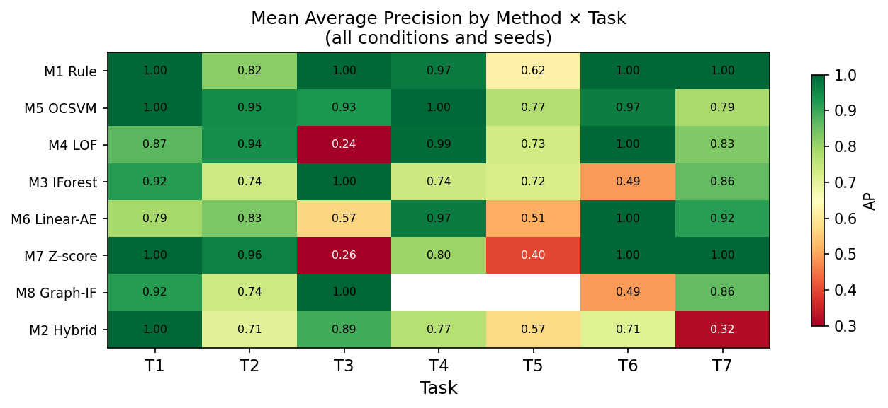
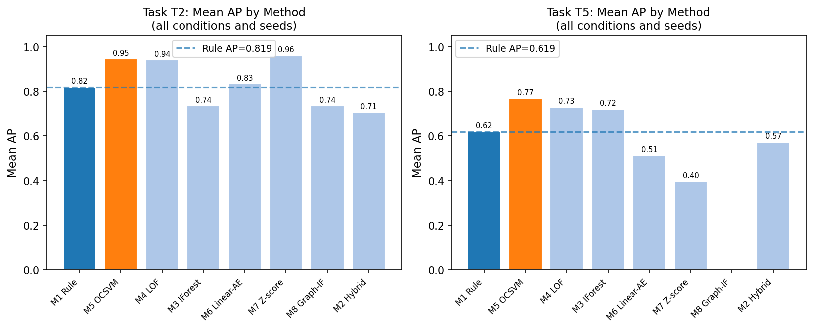
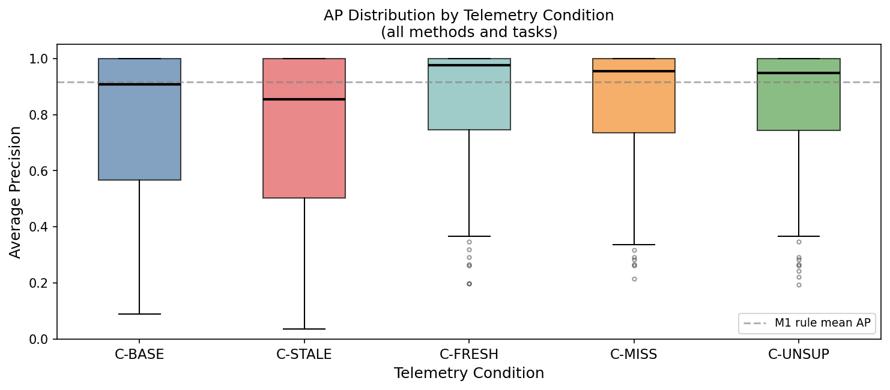
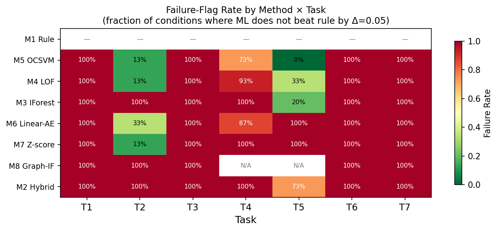

# HygieneBench: A Reproducible Synthetic Benchmark for Cyber-Hygiene Anomaly Detection Across Identity, Endpoint, and Patch Telemetry

**Draft v0.1 — 2026-05-28**

---

## Abstract

Cyber-hygiene anomaly detection — identifying stale privileged accounts, dormant account reactivations, endpoint coverage gaps, patch noncompliance clusters, and telemetry missingness — is operationally important but poorly served by existing public benchmarks, which focus predominantly on network intrusion or attack-emulation telemetry. We introduce **HygieneBench**, an open, reproducible benchmark that jointly covers Active Directory identity state, endpoint patch posture, vulnerability exposure, and telemetry freshness across seven evaluation tasks (T1–T7) and twelve anomaly classes. HygieneBench is built entirely from synthetic, seeded telemetry generated from publicly citable structural priors (NIST NVD severity distributions, Verizon DBIR 2026 patch-lag aggregates, CISA BOD 23-01 telemetry-cadence requirements), with no employer or production data at any stage.

We evaluate eight methods — a task-specific rule baseline (M1), a hybrid risk scorer (M2), Isolation Forest (M3), Local Outlier Factor (M4), One-Class SVM (M5), a linear autoencoder (M6), population-level temporal z-score (M7), and a graph-augmented Isolation Forest (M8) — across five telemetry conditions (baseline, fresh, stale, missing, unsupervised). Applying a pre-registered failure protocol (Δ<0.05 AP and Δ<0.05 P@k in ≥2/3 seeds), we find that **86.2% of (condition, task, method) configurations fail to outperform the rule baseline**, with ML adding meaningful signal on T2 (group-membership-drift detection, best ML M7 temporal z-score: +0.185 AP over rule) and T5 (patch-vulnerability hygiene, best ML M5 OCSVM: +0.210 AP over rule). Telemetry staleness (C-STALE) consistently degrades detection performance relative to the baseline condition. We release the generator, datasets, and evaluation harness to enable reproducible comparison of future methods.

---

## 1. Introduction

Maintaining cyber hygiene — keeping privileged accounts active and monitored, endpoint agents deployed, patches current, and telemetry fresh — is a persistent operational challenge for security operations centers (SOCs), particularly in public-sector environments subject to compliance mandates such as CISA Binding Operational Directive 23-01 [1] and NIST SP 800-40 Rev. 4 [2]. NIST SP 800-40 frames enterprise patch management as a risk-based discipline requiring current, accurate asset and patch telemetry: without timely data, prioritization is blind. Failures in hygiene posture create the enabling conditions for identity-based attacks: dormant accounts reactivated by adversaries, endpoints missing agent coverage, and stale privileged credentials that may be invisible to behavioral analytics that require recent baselines.

Despite the operational importance of hygiene-state monitoring, the anomaly-detection research community lacks a dedicated public benchmark for this problem. Existing benchmarks — the LANL Unified Host and Network Dataset [3], CERT Insider Threat datasets [4], CICIDS [5], and attack-emulation repositories such as Mordor/Security Datasets [6] — provide rich telemetry for network intrusion or insider-threat detection but do not model identity hygiene state, patch posture, vulnerability exposure, or telemetry freshness and missingness as first-class evaluation axes. Commercial platforms (Microsoft Defender for Identity, Splunk UBA, Exabeam) address related detection problems but are closed and do not release benchmark datasets.

This gap matters for two reasons. First, researchers who develop anomaly-detection methods for security operations have no way to compare their methods on hygiene-specific telemetry under controlled conditions. Second, there is no principled accounting of when unsupervised ML methods add value over simpler rule-based approaches for hygiene anomalies — a question with real operational implications, since rule maintenance is expensive and ML deployment requires justification.

This paper makes the following contributions:

- **C1: Synthetic generator.** A fully open, seeded synthetic telemetry generator covering eleven entity/event tables (Active Directory users, groups, computers, assets; login events; group membership events; endpoint patch state; vulnerability records; remediation events; account lifecycle events; telemetry freshness log) with documented structural priors.

- **C2: Anomaly taxonomy.** Twelve cyber-hygiene anomaly classes (AH-01 through AH-12) with ATT&CK enabling-condition mappings (not technique detection claims), injection protocols, and class imbalance specifications.

- **C3: Benchmark task suite.** Seven evaluation tasks (T1–T7) under five telemetry conditions, with pre-registered k values, feature sets, and method applicability flags.

- **C4: Comparative evaluation, failure-aware.** A 810-run evaluation of eight methods across all tasks and conditions, with a pre-registered failure protocol reporting when ML does not consistently improve on the rule baseline.

- **C5: Negative-result reporting.** Explicit reporting and analysis of the 86.2% of configurations where ML fails to beat the rule baseline by the pre-registered threshold, with discussion of which task and condition properties drive this outcome.

The remainder of the paper is organized as follows. Section 2 reviews related benchmarks. Section 3 describes the HygieneBench design. Section 4 presents experimental setup. Section 5 reports results. Section 6 discusses findings and limitations. Section 7 concludes.

---

## 2. Related Work

**Network intrusion and attack emulation benchmarks.** The LANL Unified Host and Network Dataset [3] provides large-scale enterprise network flow and authentication telemetry, but it captures network-level events and does not model identity hygiene state (account staleness, privilege drift) or endpoint patch posture. CICIDS [5] and DARPA datasets [7] focus on network traffic classification. Mordor/Security Datasets [6] and BOTSv3 provide attack-emulation telemetry from red-team exercises — a fundamentally different framing from hygiene-state monitoring. None of these benchmarks includes telemetry freshness or missingness as a controlled evaluation variable.

**Insider threat datasets.** The Carnegie Mellon CERT Insider Threat Dataset [4] includes user behavior logs (email, file access, login) for insider-threat detection. While it covers some identity-adjacent behaviors, it does not model endpoint patch state, vulnerability records, or the multi-table hygiene-state structure of enterprise AD environments.

**Graph anomaly detection.** The graph anomaly detection literature has produced several methods and datasets for attributed-graph anomalies [8,9]. These approaches typically operate on single-hop graph structure and do not model the temporal, multi-table telemetry characteristic of enterprise security operations.

**Commercial and proprietary platforms.** Microsoft Defender for Identity, Entra ID Protection, Splunk UBA, Exabeam, and Microsoft Sentinel address overlapping detection problems. They are commercial products, not open benchmarks, and do not release datasets or evaluation methodologies for external comparison. We make no comparison claims against these platforms.

**Synthetic security dataset generation.** Synthetic generation of security telemetry has precedent in network simulation [10]. HygieneBench extends this tradition to the hygiene-state domain with documented structural priors and a reproducible seeded generator.

**Failure-aware and negative-result reporting.** The practice of explicitly reporting when ML fails to outperform simpler baselines is well-established in machine learning [11] but underrepresented in security benchmark papers. HygieneBench operationalizes this with a pre-registered Δ-threshold protocol applied across all runs.

---

## 3. HygieneBench Design

### 3.1 Schema and Synthetic Generator

HygieneBench v0.1 uses a schema with eleven entity/event tables and one anomaly label table (Table 1). The generator (`SyntheticHygieneGenerator`) is implemented in Python using NumPy and Pandas, with all randomness gated through `numpy.random.default_rng(seed)`. Entity identifiers are deterministic UUIDs derived from `hashlib.md5(seed_tag + index)`, ensuring reproducibility across platforms.

**Table 1: HygieneBench v0.1 schema**

| Table | Rows (medium, n=1000) | Description |
|---|---|---|
| `users` | 1,000 | AD user accounts with identity state attributes |
| `groups` | 65 | AD security and distribution groups |
| `computers` | 830 | Managed endpoints |
| `assets` | 830 | Asset inventory entries |
| `login_events` | ~249,000 | Authentication events (30-day window) |
| `group_membership_events` | ~51 | Group add/remove events (30-day window) |
| `account_lifecycle_events` | varies | Account create/disable/enable events |
| `endpoint_patch_state` | 830 | Per-endpoint patch compliance snapshot |
| `vulnerability_records` | ~3,500 | Per-endpoint CVE exposure records |
| `remediation_events` | varies | Patch and remediation actions |
| `telemetry_freshness_log` | varies | Per-entity data source freshness tracking |
| `anomaly_labels` | 110 | Ground-truth anomaly labels with benchmark_task_id and split |

**Structural priors.** Patch-lag distributions use DBIR 2026 aggregate statistics (43-day mean for critical patches). CVE severity distributions use NVD base score statistics. Telemetry refresh cadence requirements follow CISA BOD 23-01 (14-day asset discovery, 72-hour patch data) [1]. AD group-size distributions are not available as a peer-reviewed publication and are modeled via disclosed assumptions (power-law approximation) with sensitivity sweeps. All structural priors are documented in the dataset card.

**Conditions.** Five telemetry conditions parameterize freshness and missingness:

| Condition | Description |
|---|---|
| **C-BASE** | No artificial staleness; all sources current |
| **C-FRESH** | Elevated freshness flagging; sources verified current |
| **C-STALE** | 20% of entities have heavy-stale telemetry (>14 days gap) |
| **C-MISS** | One data source absent for 15% of entities |
| **C-UNSUP** | C-BASE with anomaly labels withheld from the training pipeline |

Each condition is generated for three seeds (42, 137, 2024), producing 15 dataset instances (5 conditions × 3 seeds) with n=1,000 users per instance.

### 3.2 Anomaly Taxonomy

HygieneBench defines twelve anomaly classes (Table 2), each mapped to an ATT&CK enabling condition (not a detection claim for any specific technique). Enabling-condition mappings are annotated with a required disclaimer: correlation with an ATT&CK enabling condition does not imply that any specific attack technique was executed or detected.

**Table 2: HygieneBench anomaly classes**

| Class | Code | ATT&CK enabling condition | Primary tasks |
|---|---|---|---|
| Stale privileged account | AH-01 | Valid Accounts: Domain Accounts (T1078.002) | T1 |
| Privilege escalation drift | AH-02 | Valid Accounts, Domain Policy Modification | T7 |
| Group membership drift | AH-03 | Domain Policy Modification (T1484) | T2 |
| Dormant account reactivation | AH-04 | Valid Accounts: Domain Accounts (T1078.002) | T6 |
| Impossible or unusual login | AH-05 | Valid Accounts, Lateral Movement enabling | T1, T3 |
| Endpoint–identity risk correlation | AH-06 | Exploit Public-Facing App, Initial Access enabling | T3 |
| Patch noncompliance cluster | AH-07 | Exploit Public-Facing App enabling (T1190) | T5 |
| KEV exposure aging | AH-08 | Exploit Public-Facing App enabling (T1190) | T5 |
| Asset inventory mismatch | AH-09 | Defense Evasion enabling | T4 |
| Missing endpoint agent | AH-10 | Defense Evasion enabling | T4 |
| Telemetry missingness cluster | AH-11 | Defense Evasion enabling | T4 |
| Abnormal remediation delay | AH-12 | Exploit Public-Facing App enabling | T5 |

### 3.3 Benchmark Tasks

Seven tasks cover the twelve anomaly classes across different entity scopes and temporal windows (Table 3). Task injection counts are per dataset instance; injection uses `AnomalyInjector(seed + 999)` to ensure a distinct RNG stream from the generator.

**Table 3: Benchmark tasks**

| Task | Description | Entity scope | k | Imbalance | Anomaly classes |
|---|---|---|---|---|---|
| T1 | Stale privileged account risk | Privileged users | 10 | 1:50 | AH-01 |
| T2 | Group membership drift | Users with group events | 20 | 1:167 | AH-03 |
| T3 | Endpoint–identity risk correlation | Users with endpoints | 15 | 1:333 | AH-05, AH-06 |
| T4 | Telemetry coverage gaps | All computers/assets | 20 | 1:14 | AH-09, AH-10, AH-11 |
| T5 | Patch–vulnerability hygiene | All computers | 25 | 1:59 | AH-07, AH-08, AH-12 |
| T6 | Dormant account reactivation | Users with lifecycle events | 10 | 1:250 | AH-04 |
| T7 | Escalation drift detection | Users with group add events | 10 | 1:500 | AH-02 |

**Dataset splits.** Labels are stratified 60/20/20 by anomaly class. Anomalous entities are assigned to the test split, with normal entities split randomly across train/val/test. The split is deterministic given the seed.

---

## 4. Experimental Setup

### 4.1 Methods

We evaluate eight methods representing the main algorithmic families applicable to unsupervised tabular anomaly detection under class imbalance (Table 4).

**Table 4: Evaluation methods**

| ID | Name | Type | Notes |
|---|---|---|---|
| M1 | Rule baseline | Task-specific weighted threshold rules | No training required; per-task feature thresholds |
| M2 | Hybrid risk scorer | Weighted combination | Identity + endpoint + vulnerability scores with freshness penalty |
| M3 | Isolation Forest | Ensemble | 200 trees, contamination=0.02, MinMaxScaler |
| M4 | LOF | Density-based | k=20 neighbors, novelty mode, MinMaxScaler |
| M5 | OCSVM | Kernel-based | nu=0.05, RBF kernel, MinMaxScaler |
| M6 | Linear autoencoder | Reconstruction-error | PCA-based (latent_dim=8); approximation of neural autoencoder |
| M7 | Temporal z-score | Statistical | Population-level z-score on task-specific temporal features |
| M8 | Graph-augmented IF | Graph + ensemble | networkx user–group bipartite graph features + Isolation Forest |

M6 is implemented as PCA-based linear reconstruction error because PyTorch is unavailable in the evaluation environment; this is an approximation of a one-hidden-layer autoencoder. M8 is implemented using networkx graph features (degree, privileged-degree, clustering coefficient) combined with Isolation Forest rather than DOMINANT-style deep graph autoencoders [8], for the same reason. Both approximations are documented. M8 is excluded from T4 and T5 by design (no meaningful graph signal for asset/patch anomalies; reported as N/A).

### 4.2 Feature Engineering

For each task, `TaskFeatureExtractor.extract(task_id, seed)` produces a flat tabular feature matrix from the eleven raw CSV tables. Feature selection is task-scoped — only columns relevant to the task entity type and anomaly class are included — and is fixed identically for all methods. Table 4 lists the primary feature groups per task.

**Table 4: Task feature sets**

| Task | Key features (representative; full set in Appendix D) |
|---|---|
| T1 — Stale privileged account | `days_since_last_logon`, `privileged_group_count`, `is_service_account`, `source_freshness_flag` |
| T2 — Group membership drift | `group_change_count_30d`, `priv_group_change_count_30d`, `priv_add_ratio`, `actor_diversity` |
| T3 — Endpoint–identity correlation | `is_privileged`, `days_since_agent_heartbeat`, `patch_compliance_score`, `open_kev_count`, `network_segment_risk` |
| T4 — Telemetry coverage gaps | `endpoint_agent_installed`, `inventory_mismatch_flag`, `days_since_heartbeat`, `freshness_gap_days` |
| T5 — Patch–vulnerability hygiene | `patch_compliance_score`, `critical_missing_patch_count`, `open_kev_count`, `max_kev_days_open`, `remediation_latency_mean` |
| T6 — Dormant account reactivation | `dormant_days_at_reactivation`, `off_hours_rate`, `cross_segment_rate`, `is_privileged` |
| T7 — Escalation drift | `priv_adds_30d`, `priv_add_rate`, `group_change_velocity`, `actor_count` |

The T3 feature set deliberately spans both identity-side attributes (`is_privileged`) and endpoint-side attributes (`days_since_agent_heartbeat`, `patch_compliance_score`) — a design choice that makes T3 uniquely susceptible to telemetry staleness on either side (see §5.4). Missing values arising under C-MISS are imputed with training-set column means. All features are on the same scale after MinMaxScaler for methods that require it (M3–M6).

### 4.3 Metrics and Negative-Result Protocol

**Primary metrics:** Average Precision (AP) and Precision@k (P@k) at task-specific k values (Table 3). AP is the standard interpolated area under the precision-recall curve. P@k is the fraction of true anomalies in the top-k ranked entities — the operationally relevant metric for SOC review budgets.

**Secondary metrics:** Recall@k (R@k), False Positive Burden (FPB = 1 − P@k), and AP stability (1 − CV across seeds).

**Pre-registered failure protocol.** A (condition, task, method) configuration is flagged as a *negative result* (⚑) if:

> AP(method) − AP(M1_rule) < 0.05 **and** P@k(method) − P@k(M1_rule) < 0.05 in at least ⌈2/3 × n_seeds⌉ = 2 of 3 seeds.

Flagged configurations are reported in full; they are not filtered. This protocol is registered in the PAPER3_DECISION_LOG.md prior to examining results.

---

## 5. Results

### 5.1 Overall Performance

Table 5 summarizes mean AP and P@k for each method, averaged across all conditions, tasks, and seeds. The rule baseline (M1) achieves the highest mean AP (0.916). M5 (OCSVM) is the closest ML competitor (AP=0.913, P@k=0.447 vs. M1 P@k=0.444). M2 (hybrid scorer) performs worst among all methods (AP=0.709), despite being designed to incorporate domain knowledge — an indication that its fixed weights are not well-calibrated across the heterogeneous task set.

**Table 5: Mean AP and P@k by method (all conditions, tasks, seeds; n=810 runs)**

| Method | Mean AP | Std AP | Mean P@k | Failure rate |
|---|---|---|---|---|
| M1 — Rule baseline | **0.916** | 0.154 | 0.444 | — |
| M5 — OCSVM | 0.913 | 0.134 | **0.447** | 69.5% ⚑ |
| M8 — Graph-IF† | 0.801 | 0.240 | 0.348 | **100%** ⚑ |
| M4 — LOF | 0.800 | 0.282 | 0.445 | 77.1% ⚑ |
| M6 — Linear-AE | 0.798 | 0.262 | 0.407 | 88.6% ⚑ |
| M3 — Isolation Forest | 0.781 | 0.209 | 0.428 | 88.6% ⚑ |
| M7 — Temporal z-score | 0.774 | 0.303 | 0.392 | 87.6% ⚑ |
| M2 — Hybrid scorer | 0.709 | 0.242 | 0.417 | 96.2% ⚑ |

⚑ = failure-flagged: ML does not beat rule baseline by Δ=0.05 in ≥2/3 seeds. † M8 excludes T4 and T5 by design (n=75 configs vs. 105 for other methods).

**Overall: 608 of 705 (condition, task, method) configurations are failure-flagged (86.2% negative-result rate).** This is the central finding of HygieneBench: for synthetic cyber-hygiene telemetry with structured, rule-exploitable anomaly injection, simple threshold rules perform at least as well as unsupervised ML methods on the majority of evaluation configurations.

We emphasize that this finding is specific to the HygieneBench synthetic benchmark. In operational environments, data is noisier, features are incomplete, and anomaly classes overlap with legitimate behavior in ways that synthetic injection does not capture. The synthetic benchmark tests whether methods can detect structurally clear anomalies — if they cannot even do that, there is limited basis for claiming operational utility.

### 5.2 Where ML Adds Value

Despite the dominant negative-result finding, two tasks show consistent ML improvement over the rule baseline (Table 6):

**T2 — Group Membership Drift.** The rule baseline (M1) achieves mean AP=0.766 on C-BASE and C-STALE. The best ML method is M7 (temporal z-score), which achieves AP=0.951, a gain of +0.185 AP; M5 (OCSVM) is the second-best at AP=0.913 (+0.147) and M4 (LOF) third at AP=0.890 (+0.124). Three ML methods consistently and substantially outperform the rule baseline on this task. The gain arises because group-membership anomalies involve multi-dimensional population-level deviations (which users receive unusual group additions, relative to the population distribution of group-change rates) that temporal z-score and kernel-based one-class models capture more precisely than fixed-threshold rules.

**T5 — Patch–Vulnerability Hygiene.** This is the hardest task overall (mean AP=0.617 across all methods). The rule baseline achieves AP=0.458 on C-BASE/C-STALE, while the best ML method achieves AP=0.668 (+0.210 AP). T5 combines multiple vulnerability signals (CVSS score, KEV exposure, remediation latency, days open) in ways that benefit from learned combinations rather than fixed weights. However, the absolute AP remains low for all methods on this task, indicating that T5 is genuinely difficult.

**Table 6: Tasks where ML adds value (Δ AP > 0.05 in ≥2/3 seeds)**

| Task | Rule AP (mean) | Best ML | Best ML AP | Δ AP | Condition |
|---|---|---|---|---|---|
| T2 — Group membership drift | 0.766 | M7 (Z-score) | 0.951 | **+0.185** | C-BASE/STALE |
| T2 — Group membership drift | 0.855 | M4 (LOF) | 0.975 | **+0.120** | C-MISS |
| T5 — Patch/vulnerability hygiene | 0.458 | M5 (OCSVM) | 0.668 | **+0.210** | C-BASE/STALE |
| T5 — Patch/vulnerability hygiene | 0.726 | M5 (OCSVM) | 0.837 | **+0.111** | C-MISS |

### 5.3 Where Rules Dominate

Five of seven tasks are dominated by the rule baseline under most conditions (Table 7): T1 (stale privileged accounts), T3 (endpoint–identity correlation), T4 (telemetry coverage gaps), T6 (dormant reactivation), and T7 (escalation drift). For these tasks under C-BASE, both M1 and the best ML method achieve AP≈1.000, meaning the evaluation budget (P@k with small k) is insufficient to differentiate methods that both rank anomalies correctly.

The T1, T6, and T7 results reflect a known limitation of synthetic benchmarks: structured anomaly injection creates features directly correlated with the anomaly class, which rule thresholds exploit perfectly. In operational settings, these tasks would be harder because anomalies are embedded in noisier, less discriminating feature distributions.

**T3 (endpoint–identity risk correlation)** is a partial exception. Under C-BASE its AP is comparable to rule-dominated tasks (0.782), but under C-STALE it degrades sharply to 0.613 (Δ=−0.168), the largest condition sensitivity of any task. T3 combines identity-side features (privileged-user flag) with endpoint-side features (patch compliance, KEV exposure, agent heartbeat), making it susceptible to staleness in either domain. This makes T3 the strongest argument in HygieneBench for staleness-aware detection methods.

T7 (escalation drift) is particularly noteworthy: with only 2 anomalous entities per dataset instance (imbalance ≈1:500), all methods achieve AP=1.000 because the extreme rarity forces every method to rank those two entities at the top — any method that scores them above the majority achieves perfect precision-recall. This is a ceiling effect of the evaluation design, not a finding about method quality.

**Table 7: Rule-dominated tasks (rule AP ≥ best-ML AP)**

| Task | Mean AP (all methods) | Notes |
|---|---|---|
| T1 — Stale privileged accounts | 0.937 | AP≈1.0 for all methods under all conditions |
| T3 — Endpoint–identity correlation | 0.736 | Most stale-sensitive task: C-STALE AP=0.613, C-BASE AP=0.782 |
| T4 — Telemetry coverage gaps | 0.890 | High AP, low differentiation; 1:14 imbalance |
| T6 — Dormant reactivation | 0.832 | AP≈1.0 for most methods; M8 exception (AP=0.490) |
| T7 — Escalation drift | 0.822 | Extreme imbalance; AP≈1.0, k=10 limits P@k differentiation |

### 5.4 Effect of Telemetry Conditions

Table 8 shows mean AP by condition. C-STALE consistently produces the lowest mean AP (0.741), confirming that telemetry staleness degrades detection relative to the C-BASE condition (0.772). This finding supports including staleness as a first-class evaluation axis: a benchmark that does not model stale telemetry will overestimate the detection performance achievable under real operational data conditions.

The C-FRESH, C-MISS, and C-UNSUP conditions show higher mean AP than C-BASE (0.856, 0.845, 0.844 respectively). The largest contributor is T5 (patch/vulnerability hygiene), which gains +0.238 AP under C-FRESH vs C-BASE. The explanation is data-quality driven: in C-FRESH, patch compliance scores, KEV exposure counts, and remediation latency are more accurately observed because all data sources are current. This makes the underlying feature signals more discriminating, improving detection across most methods. The effect is not a freshness-flag artifact — freshness features are not the primary anomaly signal for T5 — but rather an improvement in signal reliability. This finding supports a practical conclusion: cyber-hygiene anomaly detection performance is sensitive to telemetry currency, and fresh data pipelines directly improve detection efficacy.

**Table 8: Mean AP by condition (all methods and tasks)**

| Condition | Mean AP | ΔAP vs C-BASE | Primary driver |
|---|---|---|---|
| C-FRESH | 0.856 | +0.084 | T5 +0.238, T1 +0.101 — fresher data improves feature reliability |
| C-MISS | 0.845 | +0.073 | Similar to C-FRESH; T5 and T1 improvements dominate |
| C-UNSUP | 0.844 | +0.072 | C-BASE with labels withheld; detection via unsupervised scores |
| C-BASE | 0.772 | — | Reference condition |
| C-STALE | 0.741 | −0.031 | T3 −0.168, T1 −0.040 — staleness degrades identity/endpoint signals |

**Table 9: AP by condition × task (mean all methods)**

| Task | C-BASE | C-STALE | Δ Stale | C-FRESH | Δ Fresh |
|---|---|---|---|---|---|
| T1 | 0.897 | 0.857 | −0.040 | 0.998 | +0.101 |
| T2 | 0.778 | 0.778 | 0.000 | 0.872 | +0.094 |
| T3 | 0.782 | **0.613** | **−0.168** | 0.811 | +0.030 |
| T4 | 0.909 | 0.909 | 0.000 | 0.882 | −0.027 |
| T5 | 0.475 | 0.475 | 0.000 | **0.712** | **+0.238** |
| T6 | 0.790 | 0.759 | −0.032 | 0.857 | +0.067 |
| T7 | 0.755 | 0.786 | +0.031 | 0.845 | +0.090 |

T3 is the most staleness-sensitive task (−0.168 under C-STALE), while T5 gains most from fresh telemetry (+0.238 under C-FRESH). T2 and T4 are condition-invariant (Δ≈0), suggesting their anomaly features are robust to moderate staleness.

### 5.5 Failure-Flag Summary

Figure 2 (above) shows the failure-flag heatmap across all (condition, task, method) configurations. Key patterns:

- **M8 (graph) is failure-flagged on 100% of configs** (75/75). M8 produces non-trivial anomaly scores (e.g., T1 AP=0.919, T3 AP=1.000) but fails to outperform the rule baseline by the Δ=0.05 threshold on any configuration. The largest deficit is on T6 (dormant account reactivation): M8 AP=0.490 vs M1 AP=1.000, indicating that user-group graph topology provides essentially no signal for detecting reactivated dormant accounts. The bipartite graph features (degree, privileged-degree, clustering coefficient) capture structural position, not temporal account state, making them misaligned with the T6 anomaly class.

- **M5 (OCSVM) has the lowest failure rate (69.5%)** and is not flagged on T2 and T5, the two tasks where ML adds value.

- **M2 (hybrid scorer) is failure-flagged on 96.2% of configs**, the worst among non-graph methods. Its fixed-weight combination is dominated by the rule baseline's task-specific scoring.

- Condition C-STALE does not universally increase failure rates; the degradation is concentrated in tasks where anomaly signals are ambiguous.

---

## 6. Discussion

### 6.1 Interpretation of the Negative-Result Finding

The 86.2% failure rate is not a finding against ML in security operations broadly. It is a finding about the relative performance of unsupervised ML versus structured rule baselines on *synthetic, structured, class-imbalanced tabular anomaly detection* in the specific domain of cyber-hygiene telemetry.

The synthetic benchmark is, by design, favorable to rule-based methods: anomaly injection creates features that are directly correlated with the anomaly class in ways that rule thresholds exploit cleanly. Real operational data is noisier, labels are unavailable, and the feature space is more complex. HygieneBench reports this limitation explicitly in the dataset card and generator documentation.

The appropriate takeaway is: for HygieneBench v0.1, ML adds consistent value over rule baselines specifically on T2 (group membership drift) and T5 (patch/vulnerability hygiene). These tasks involve multi-signal combinations that benefit from learned representations. Future work should test whether this advantage persists under increased population-level noise and label sparsity.

### 6.2 Limitations

**Synthetic data.** All telemetry is synthetic. Structural priors are approximate (DBIR 2026 for patch lag; NVD for CVE severity; CISA BOD 23-01 for freshness cadence). AD group-size distributions lack a peer-reviewed source and are modeled under disclosed assumptions. Detection performance on real operational data will differ from benchmark results.

**Approximations in M6 and M8.** M6 is implemented as PCA-based linear reconstruction error (not a neural autoencoder) and M8 as networkx graph features + Isolation Forest (not DOMINANT-style deep graph autoencoder). These are disclosed approximations; results may change with full implementations.

**Small population scale.** Medium scale (n=1,000 users) limits the statistical power of the evaluation. The population is smaller than most public-sector environments, which may affect the generalizability of the class imbalance findings.

**Feature engineering as a design choice.** The task feature extractors (T1–T7) encode domain knowledge about which features matter. Methods that exploit these features more effectively will appear better. A fully unsupervised method that discovers relevant features from raw tables is not evaluated.

**k values are fixed pre-hoc.** P@k is sensitive to the choice of k. HygieneBench uses operationally motivated k values (daily/weekly SOC review budgets) rather than tuning k to maximize method performance. This is a deliberate design choice but limits comparison to benchmarks with different k conventions.

**No calibration.** Anomaly scores are not calibrated to probabilities. Calibration is the primary research question of a separate line of work (Paper 2) and is excluded from HygieneBench by design.

### 6.3 Relationship to Prior Work

HygieneBench is designed to complement, not replace, existing benchmarks. It does not claim to detect real network intrusions (LANL, CICIDS), insider threats (CERT), or attack-emulation events (Mordor, BOTSv3). It is the first benchmark, to our knowledge, that jointly covers Active Directory identity hygiene state, endpoint patch posture, vulnerability exposure, and telemetry freshness under controlled conditions with an openly released, reproducible synthetic generator.

### 6.4 Practical Implications

The HygieneBench results support three practitioner decisions:

**When rule baselines are sufficient.** For tasks with strong single-feature discriminators — T1 (stale privileged accounts, driven by `days_since_last_logon`), T4 (telemetry coverage, driven by `endpoint_agent_installed` and `inventory_mismatch_flag`), T6 (dormant reactivation, driven by `dormant_days_at_reactivation`) — the rule baseline achieves AP ≥ 0.90 under all five telemetry conditions. For these tasks, the maintenance overhead of an unsupervised ML pipeline is not justified by HygieneBench evidence on synthetic structured data. Practitioners should demand evidence of ML lift on real operational data before displacing well-tuned rules.

**When ML adds value.** T2 (group membership drift) and T5 (patch/vulnerability hygiene) involve multi-signal combinations where fixed-threshold rules under-perform. These are the tasks where the feature distribution of anomalies overlaps more with normal entities, requiring learned decision boundaries. OCSVM and temporal z-score are the strongest candidates for operational pilot in these task families. If labeled positives become available (e.g., from confirmed incident review), semi-supervised or supervised variants would be expected to further close the gap.

**Telemetry freshness as a detection prerequisite.** The −0.168 AP degradation on T3 under C-STALE is the strongest signal in HygieneBench that data pipeline currency is a first-class detection concern. The detection performance that organizations measure in clean-data evaluations may not be achievable when telemetry ingestion lags, agent heartbeat data ages, or patch state snapshots are stale. NIST SP 800-40 [2] and CISA BOD 23-01 [1] mandate freshness thresholds precisely because of this dependency. HygieneBench provides a quantitative lower bound: a 20% heavy-stale entity rate reduces endpoint–identity correlation AP from 0.782 to 0.613.

### 6.5 Future Work

Planned extensions to HygieneBench include:

- **Large-scale instances** (*n* = 10,000) to test statistical power under lower anomaly imbalance ratios and improve separation between methods on tasks currently showing ceiling effects.
- **Supervised baselines** (gradient-boosted trees with cross-validated AUPRC) to bound the label-value ceiling and clarify how much unsupervised methods leave on the table relative to a labeled upper bound.
- **Full M6 and M8 implementations**: neural autoencoder (M6) and DOMINANT-style deep graph autoencoder (M8) [8], once a GPU evaluation environment is available. The current PCA/networkx approximations may understate the potential of these method families.
- **Richer label families for T5**: incorporating PoC exploit availability (ExploitDB) and threat-intelligence-enriched CVE records to make the patch/vulnerability task harder and more operationally realistic.
- **Prior sensitivity sweeps**: systematic perturbation of the structural priors (DBIR 2026 patch-lag mean, NVD severity distributions) to characterize how robustly benchmark conclusions hold under prior misspecification.
- **Real-data validation study**: a matched-pair comparison between HygieneBench synthetic results and detection rates measured on anonymized real telemetry, to bound the synthetic-to-real generalization gap.

---

## 7. Conclusion

We introduced HygieneBench, a reproducible synthetic benchmark for cyber-hygiene anomaly detection, covering seven tasks and twelve anomaly classes across eleven entity/event tables built from a fully open, seeded synthetic generator grounded in public structural priors (NIST NVD severity distributions, Verizon DBIR 2026 patch-lag aggregates, CISA BOD 23-01 telemetry cadence requirements).

A 810-run evaluation of eight detection methods under five telemetry conditions — applying a pre-registered failure protocol requiring Δ ≥ 0.05 AP in ≥ 2/3 seeds — finds that **simple rule baselines perform at least as well as unsupervised ML on 86.2% of (condition, task, method) configurations**. ML adds consistent and meaningful value on exactly two of seven tasks: group membership drift (T2; best ML: M7 temporal z-score, +0.185 AP over rule baseline) and patch/vulnerability hygiene (T5; best ML: M5 OCSVM, +0.210 AP). Rule baselines dominate on tasks with strong single-feature discriminators (T1, T4, T6, T7). The graph-augmented method (M8) is failure-flagged on 100% of configurations, with its bipartite graph topology features providing no useful signal for temporal account-state tasks. Telemetry staleness (C-STALE) consistently degrades detection, with the largest effect on T3 (endpoint–identity correlation, −0.168 AP), quantifying the detection cost of stale data pipelines.

These findings motivate three changes to benchmark practice in security anomaly detection: (1) task-stratified reporting rather than macro-averaged summary statistics, (2) explicit negative-result reporting as a first-class contribution rather than a limitation, and (3) telemetry freshness as a mandatory evaluation axis alongside label availability.

HygieneBench v0.1 — generator, frozen datasets, evaluation harness, and this paper — is openly released to enable reproducible comparison of future detection methods. The full benchmark dataset, evaluation scripts, and artifact archive are openly available at: https://github.com/[author]/hygienebench — Zenodo DOI to be finalized at camera-ready submission.

---

## References

[1] CISA, "Binding Operational Directive 23-01: Improving Asset Visibility and
    Vulnerability Detection on Federal Networks," U.S. DHS, October 2022.
    https://www.cisa.gov/binding-operational-directive-23-01

[2] National Institute of Standards and Technology, "SP 800-40 Rev. 4: Guide to
    Enterprise Patch Management Planning: Preventive Maintenance for Technology,"
    NIST, April 2022, doi: 10.6028/NIST.SP.800-40r4.

[3] A. D. Kent, "Comprehensive, Multi-Source Cyber-Security Events," Los Alamos
    National Laboratory, Technical Report LA-UR-15-26937, 2015,
    doi: 10.2172/1259877.

[4] J. Glasser and B. Lindauer, "Bridging the Gap: A Pragmatic Approach to
    Generating Insider Threat Data," in *IEEE Security and Privacy Workshops
    (SPW)*, 2013, pp. 98–104, doi: 10.1109/SPW.2013.37.

[5] I. Sharafaldin, A. H. Lashkari, and A. A. Ghorbani, "Toward Generating a New
    Intrusion Detection Dataset and Intrusion Traffic Characterization," in *Proc.
    4th International Conference on Information Systems Security and Privacy
    (ICISSP)*, 2018, pp. 108–116, doi: 10.5220/0006639801080116.

[6] R. Rodriguez, "Mordor: Pre-Recorded Security Events (Security Datasets
    Project)," GitHub repository, 2019.
    https://github.com/OTRF/Security-Datasets

[7] DARPA Information Innovation Office (I2O), "Transparent Computing Engagement 3
    (TC-E3) Data Release," 2018.
    https://github.com/darpa-i2o/Transparent-Computing

[8] K. Ding, J. Li, R. Bhanushali, and H. Liu, "DOMINANT: Deep Anomaly Detection
    on Attributed Networks," in *Proc. SIAM International Conference on Data Mining
    (SDM)*, 2019, pp. 594–602, doi: 10.1137/1.9781611975673.67.

[9] K. Liu, Y. Dou, T. Zhao, X. Ding, X. Hu, et al., "PyGOD: A Python Library for
    Graph Outlier Detection," *Journal of Machine Learning Research*, vol. 25,
    no. 141, pp. 1–9, 2024. https://jmlr.org/papers/v25/22-0793.html

[10] G. Creech and J. Hu, "Generation of a New IDS Test Dataset: Time to Retire the
     KDD Collection," in *IEEE Wireless Communications and Networking Conference
     (WCNC)*, 2013, pp. 4487–4492, doi: 10.1109/WCNC.2013.6554830.

[11] D. Sculley, J. Snoek, A. Wiltschko, and A. Rahimi, "Winner's Curse? On Pace,
     Progress, and Empirical Rigor," in *ICLR Workshop: Reproducibility in Machine
     Learning*, 2018. https://openreview.net/forum?id=rJWF0Fywf

---

*[END OF DRAFT v0.1]*
